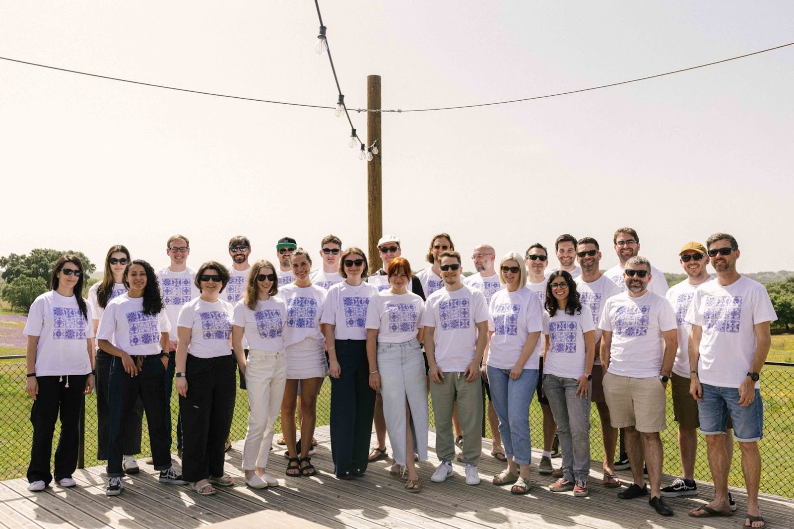

In a post-pandemic world that is slowly returning to offices, at Xata we still believe in the power of remote work - we believe it empowers us as a team to do the best work possible for our product.

But sometimes being assigned one colleague every other week for a virtual #donut-bot-meeting is not enough to build a strong and connected team if there's 30 people working remotely from 10 different countries across multiple continents.  
That's why we get together twice a year for a week-long offsite to experience our team in real life instead of just on the screen.
Most recently, we got a chance to meet in Evora, Portugal and spend 5 days taking in breathtaking views of the Portuguese hilly landscape and enjoying a bit of early summer sun.
But offsites are not just a fun opportunity to vacation with your coworkers, they become an integral part of the company culture and leave a lasting impact for the remainder of the year.

There's three key elements to every Club Xata Reunion - we come together to

1. Collaborate in person
2. Create unforgettable memories
3. Connect authentically with our team

Here's what that looks like for us:

# Collaborating

We love the benefits of remote work the rest of the year but nothing can quite replace actually sitting round a table with our team and brainstorming a new feature. That's why we dedicated a big chunk of our time in Evora to working together in person. We kicked off the working sessions with a vision meeting where Monica, our CEO, and other leaders shared their insights on where Xata is headed. We also got updates from different team leads, which helped everyone get on the same page and see the bigger picture instead of just the puzzle piece of our own individual work.
We then collaborated in smaller groups in a total of 13 working sessions over the next two days.

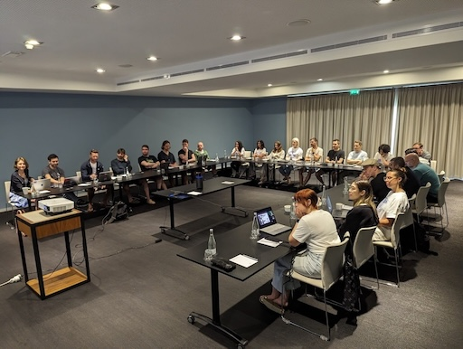

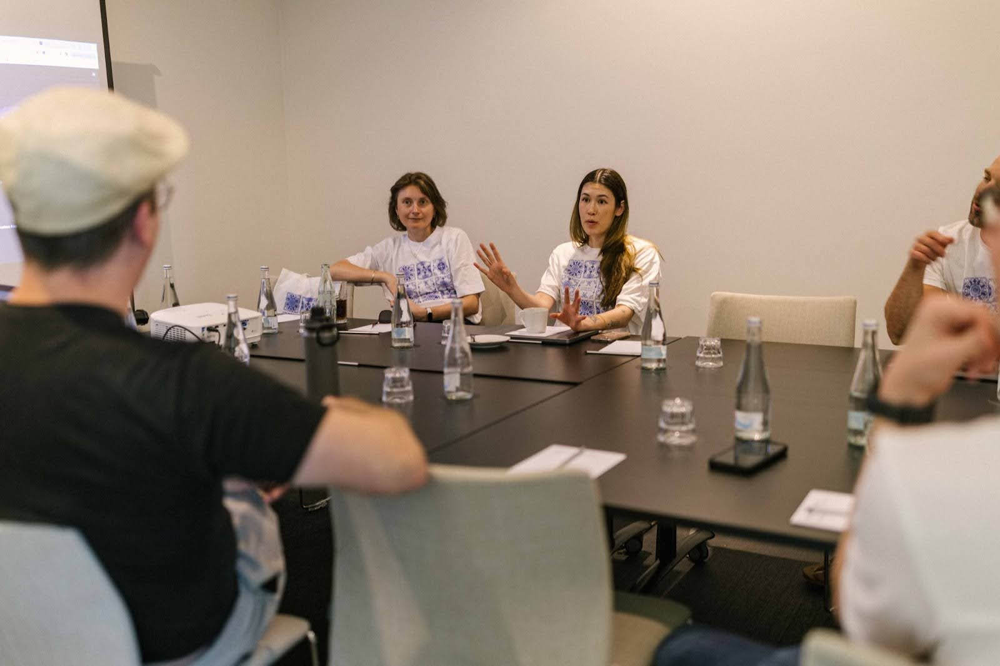

The value of these in-person working sessions is immeasurable to our team. In a setting where we are able to gain instant feedback and iterate ideas on the spot, we can move fast and develop brand new ideas in a matter of hours instead of weeks of zoom meetings. On top of that, being face to face with the team also allows us to sync up our diverse perspectives into one unified strategy for the future of Xata.

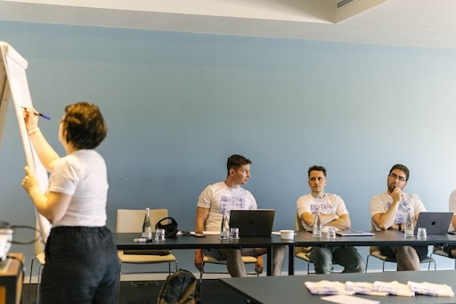

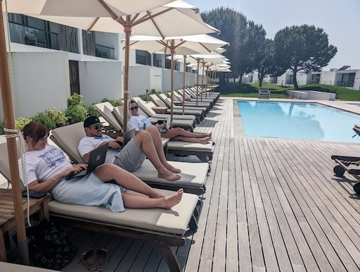

# Creating memories

Of course an offsite is not all about just working together, but also bonding by building fun new memories together that we will remember for many years to come. That's why we split up in different interest-based activity groups almost every day.  
One of the week’s highlights for sure was the early morning hot air balloon ride over the hills and lakes of Evora. The most adventurous of our team members rose before dawn to be able to experience floating in a giant basket over 300 meters above the lakes and flower fields of Evora.

Another group stayed closer to the ground and explored the countryside and old town of Evora on a fun bike excursion.

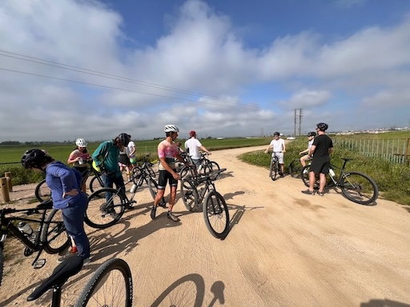

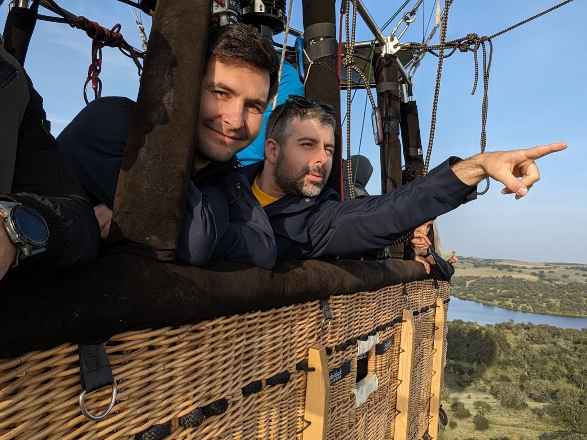

We also organized a laser tag tournament and a pottery class another day.

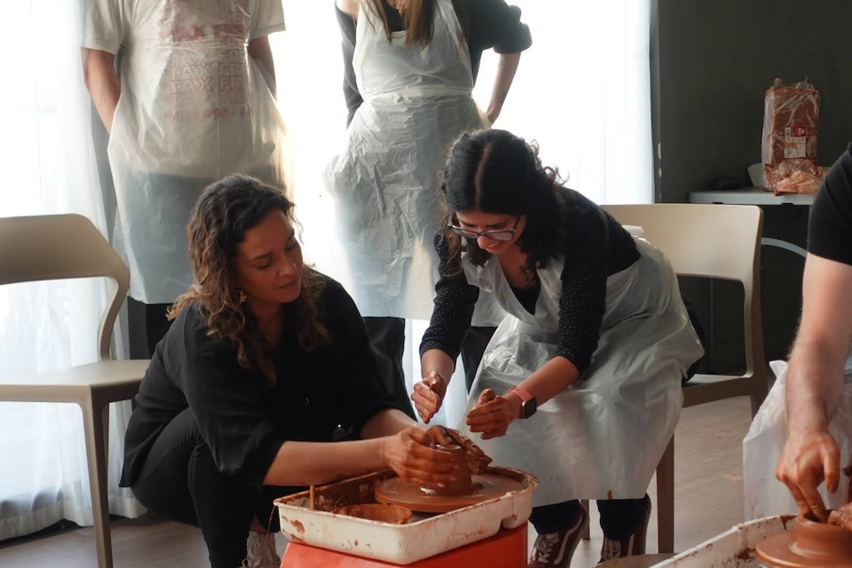

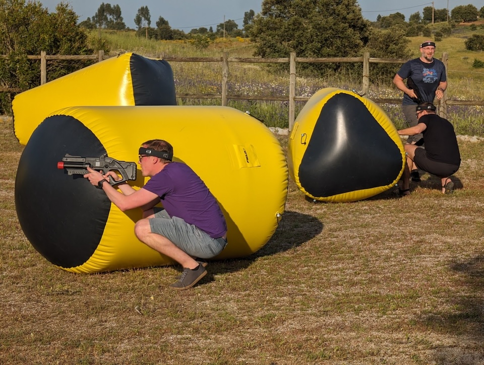

Of course we also always make sure to do one activity as a big group, which this time was a big cardboard boat pool race. We raced against the clock and the other teams to build the best looking and floating boat out of just cardboard, some styrofoam and clingfilm. We are proud to announce that 4 out of 5 boats passed the strenuous floating tests. Of course the winners of the race shared the price with the whole team, though.

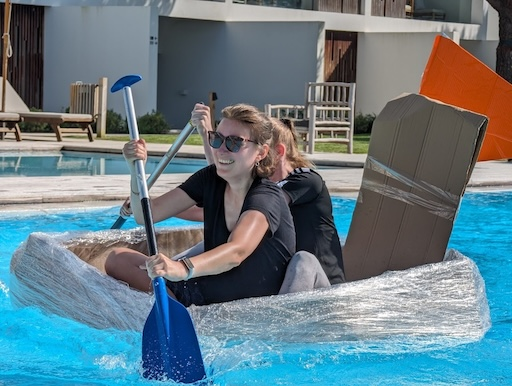

# Connecting

Work and play are both important but what truly set this offsite apart were the spontaneous, informal interactions. These informal times of just "hanging out" are the building blocks of our team’s strong, interconnected culture. They remind us that at the heart of a successful startup is not just a great product, but great people who understand and care for each other.

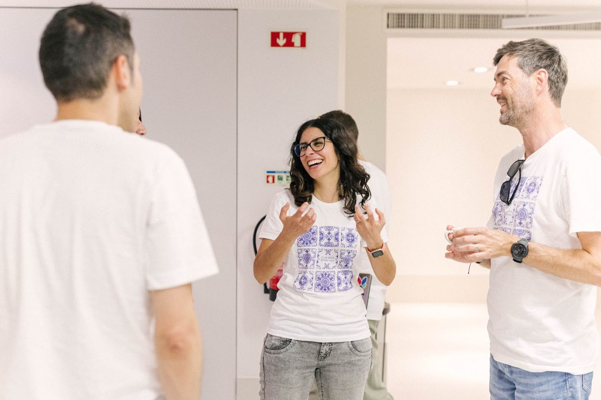

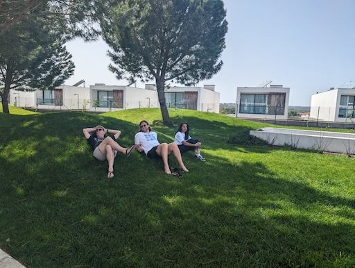

We intentionally carve space out of the week's schedule to be free of work or structured activities, so everyone has the chance to get to know their colleagues to create true, authentic connections. Whether we were dining at a local restaurant or just hanging out at the pool, these moments allowed us to connect on a deeper and personal level. Instead of just working beside each other we were able to connect with each other and turn coworkers into friends.

Part of building authentic relationships is meeting people when they feel the most comfortable to be themselves. That's why we invite every team member to bring their family and spouse along to meet the team as well. This not only strengthens our community but also deepens our understanding of each other, building a truly supportive (and family-friendly!) work environment.

# Looking ahead

As we wrapped up our week in Évora with heavy hearts, it was clear that the connections made and ideas created have set us on an exciting path forward. This offsite reinforced our commitment to each other and reignited the spark of our collaboration and teamwork.  
Now we are excited to get back to our regular work as a fully remote team and cannot wait to share with you what we are up to in the coming months as the result of our work in Evora.

# Join us on our journey

Interested in being part of our next adventure? Visit Xata.io to learn more about our work and culture, and perhaps find your place among us.

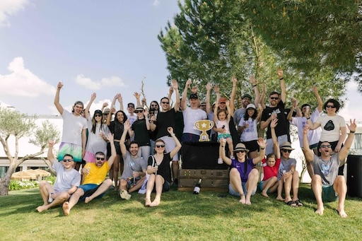
