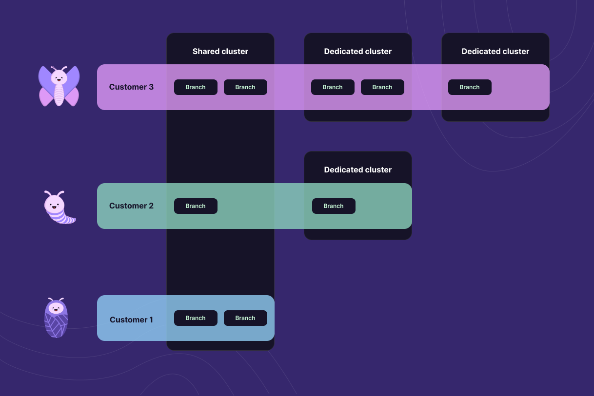

Today we are excited to announce dedicated clusters! Dedicated clusters provide better scalability, security and noisy neighbor isolation, as well as better economics at scale for your Postgres databases on Xata. We are rolling this out in an Early Access Program (EAP) and you can [request access starting today](https://5i8caik7lja.typeform.com/to/Gh5lin22).

The key features of dedicated clusters are:

- Xata databases and branches can be allocated to a dedicated cluster. You can allocate a single branch (for example, only your production branch) or multiple branches (for example, all your development branches).
- You'll be able to move Postgres databases between dedicated clusters with no or minimal downtime.
- You can configure dedicated clusters with a configurable number of read replicas, and you can ask for them to be in different availability zones.
- You can choose between a wide range of [instance types](/docs/dedicated-cluster#provisioned-instances) or you can define a minimum and maximum CPU/RAM configuration and let [auto-scaling](/docs/dedicated-cluster#auto-scaling-instances) choose the right size dynamically based on load. Scaling up is almost instant and scaling down is done automatically in a matter of minutes.
- The per-GB cost of storage is significantly cheaper (20 times less!) than the storage cost for shared clusters.
- A dedicated cluster is free from all limitations we impose on our shared clusters to protect from abuse: [rate and concurrency limits](/docs/rest-api/limits) as well as some limitations on the [SQL commands](/docs/postgres#supported-statements) you can execute.

Before we dive into the specifics of dedicated clusters, let's take a step back and provide some insight into our current architecture so you can understand the difference and the importance of having optionality.

## Shared cell architecture

Xata has a **cell-based architecture**, in which each cell consists of a Postgres Aurora cluster, an Elasticsearch cluster, a queue, and the associated services that serve the Data API, the SQL wire protocol, and more. The cells form our data plane where we serve our users through our Data API and the Postgres wire protocol.

We have several cells in one region and each of them is multi-tenant. Essentially, they are being shared between several users, which allows us to offer a generous [free tier](/blog/serverless-postgres-platform#the-free-tier) (15GB of storage, HA included, no pausing) and in general a very good offering for “small scale”. Having this cell-splitting system in a region ensures that one noisy neighbor will not affect the whole region. It will, however, affect the cell they live in. In order to mitigate the noisy neighbor issues, we have rate limits and concurrency limits in place and we are monitoring for abuse.

This approach is great for small projects, indie developers and so on. When your project grows beyond a few tens of GB in storage however, there are benefits to having your own dedicated infrastructure. You also get more control over the cluster configuration (quantity of read replicas, auto-scaling policies, etc.). Dedicated infrastructure also makes it a lot easier to go through security reviews and other compliance processes.

Our dedicated clusters are, at their core, dedicated cells. You can create branches on them and use them just like you use your branches that got created on shared cells. The difference is, it is only you living in that cell.

## Dedicated Clusters Infrastructure

With the addition of dedicated clusters, we are allowing users to create infrastructure on demand, via a CRUD management API, which is exposed in the Xata UI.

This means that at any given moment, a user will be able to add to our fleet of cells in a region, and we need to be able to allocate database branches to the new cells.

As a concept, a cluster “lives” under a workspace, at the same level as a database. Both clusters and databases can only be created in the context of a region and there is a many-to-many relationship between them. You can have database branches created on different dedicated clusters and at the same time you can have branches from various databases created on the same dedicated cluster.

Under the hood, we use Kubernetes to manage both infrastructure and networking via [Crossplane](https://www.crossplane.io/), a CNCF project for building and managing control planes. The configuration and desired state of this infrastructure are stored in Kubernetes as custom definitions backed by Crossplane, and it falls to Crossplane to call the relevant APIs and reconcile this desired state with AWS.

All of the supporting Xata cell services are uniquely created on a per-cell basis for dedicated clusters, and these also run in Kubernetes. These are created and managed alongside the infrastructure that Crossplane manages. These services are not shared between every dedicated cluster within a workspace but serve traffic only to that single dedicated cluster, allowing more granular control over considerations like traffic management, scaling, and deployments.

## Dedicated Clusters Challenges

When implementing the backend support for dedicated clusters, we had some architectural challenges to deal with.

### Multiple sources of truth

As you can see in the diagram below, Xata stored metadata at various levels. There is metadata stored in the control plane central metadata store - for the entities that need to be known at workspace level and there is also a regional metadata store where the regional entities' information is stored.

On top of that, because we use Kubernetes to manage the on-demand infrastructure, it has its own metadata data store as well.

A dedicated cluster is a regional entity that needs to be known at the workspace level and also at the regional level. Kubernetes spins up the dedicated infrastructure, which means it also needs to hold data on the cluster.

That leaves us with three data stores that we need to keep in sync.

To solve this, we observed the following: The data stores do not need the same data replicated in all of them. They hold different views on the cluster and these views need to be coherent.

- The central storage has information about the request the user sent: cluster name, desired state, workspace, region.
- Kubernetes cares about the configuration. The configuration is also specified in the request, but in time this may suffer changes from the initial request (e.g. software upgrades) - so from that perspective, the storage in Kubernetes is the single source of truth.
- For regional storage the dedicated cluster is regarded as a cell, there is no need to know the infrastructure configuration for instance. We only need to know the networking specifics related to the cell (e.g. endpoints).

There is a piece of data that connects all these different views of the cluster - and that is the cluster ID that we generate, so we can easily ensure uniqueness and standardization of the format.

We then applied a series of well-known patterns/best practices to ensure we show a consistent view to the user:

1. Only one of these storage layers needs to be visible to the user. For this, the decision is simple: the CRUD APIs are used at the control plane level, so the control metadata storage will be the only visible storage.
2. The storage layer visible to the user will be the last to be updated.
3. Updating these storages never happens in sync, but one after the other. Let's explain for instance how starting an instance works:

As you can see, we always make sure to update one view after another. Of course, any of these updates can fail, sometimes in an unrecoverable way, in which case the final state of the cluster will get updated to a failure state.

As can happen with distributed systems, sometimes there will be no explicit failure, but no result will trigger moving to the next update. In this case, the only recorded information in the control plane will be the user intention - to start/stop or create a cluster.

If that happens, the operation will be considered as Timed Out after a while and the user will be free to retry.

### Provisioning on-demand infrastructure takes time

We know this seems pretty obvious, but anything that takes time cannot be a synchronous operation. This means API implementation has to make way for asynchronous operations. The way we do this is we return from the API call immediately after storing the user intention to provision a cluster or stop it or restart it. Then, using the cluster ID, the user can get updates on the evolution of the creation process via the Xata UI.

From a user perspective, we care primarily about one thing in this context of on-demand infrastructure: when is everything up and ready and available for use? Out of the box, Crossplane doesn't directly inform us when reconciliation has been completed, at least not without being interrogated on its current view of the world. We created our own custom Crossplane Composition Function that is called every time Crossplane itself checks internally on state reconciliation. When all the resources we care about are reported to have been created and are marked as ready, we fire off a Kubernetes Event that we then consume and use internally to mark the dedicated cluster as ready for use. This final step marks the dedicated clusters as “Ready” in the Xata UI, at which point they can be used and have databases and branches created on, or moved to them.

Another thing that comes out of the asynchronous behavior is the need to have notifications when things are ready - or failed, but let's be optimistic. We are relying on notifications to tell us when the clusters are running, or in a stopped state.

### Cluster state machine

Even without explicitly planning to, we kept talking about cluster states a couple of times. It comes natural to think about the dedicated cluster as going from one state to another, moved by different events, until it reaches a final state - **Running**, **Failure**, **Stopped**, or **Terminated**.

We added a state machine in code to deal with cluster states. The actual code could have happily existed on its own, but adding this layer of abstraction has made explaining how things work and adding new states to the state machine a lot easier.

### Allocating branches to a dedicated cluster

Well this was fun, we managed to create a dedicated cluster on demand! But that is not our end goal. Our end goal is that we are able to use a dedicated cluster seamlessly as if it were a shared cluster.

The main issue here is that with shared clusters, we have our own allocation algorithm that, on branch creation, checks what cell is the most empty and sends the branch to that cell (or cluster). With dedicated clusters, we don't want that. As a user, I want to tell Xata “create a branch on this cluster I just created for myself” and have the allocation algorithm point to that. So what we needed was to have an “on-demand” allocation as well, along with “on-demand cell/cluster creation”.

Some of the limitations that we have in place for shared clusters (concurrency and rate limiting, as well as limiting some SQL commands) don't make sense for dedicated clusters. You get a whole cluster by yourself so you should only be limited by the compute and IO power of the cluster you have provisioned.
We make it possible to temporarily stop dedicated clusters if you don't need them for a period of time. This is not something that ever happens to shared clusters. So that is a whole new state in which a cell/cluster can be and our system had to accommodate it.

If you'd like to use dedicated clusters, please request access via our [Early Access Program (EAP)](https://5i8caik7lja.typeform.com/to/Gh5lin22).

## Learn more

Learn more about the development of this feature from the folks that built it, and watch a quick demo to see it in action. Check out our latest meet the makers session here:

<ArticleVideo platform="youtube" src="https://www.youtube.com/embed/5PtAeNkKGCE?si=PNX2ws8dI_-mBl9G" />

Pop into [Discord](https://xata.io/discord) and say hi if you'd like to dig in further 👋

If you don't yet have a Xata account, there's no better time to [create one](https://app.xata.io/signup)!
