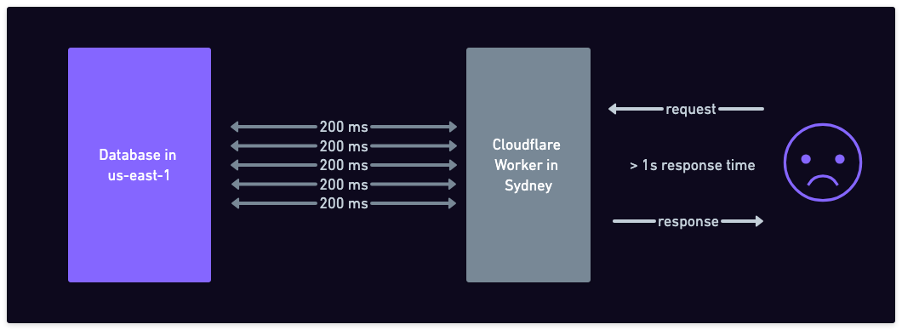

We'd like to document a pattern for distributing Postgres workloads to multiple regions or even multiple clouds. You can do this with any managed Postgres service or by self-hosting, it doesn't rely on any particular functionality beyond what is available in a standard Postgres installation.

In short, the pattern is:

- separate per-tenant data tables from the control plane tables.
- place the per-tenant data tables in the region closest to the user.
- create a global view of the data by using foreign data wrappers and partitioning.
- Keep authentication and control plane data in a single region.

## Why

First, many applications happily live in a single region and there's no reason to complicate them. However, if you have a global customer base, there are a few reasons for which you might consider distributing your data to multiple regions:

- Offer better latencies. A round-trip-time from Sydney to us-east-1 is about 200 milliseconds, and there's not much you can do about that. If you know that a particular customer lives in Australia, it makes sense to store their data there.
- Data protection. Regulation ([with greetings from the EU](https://commission.europa.eu/law/law-topic/data-protection/reform/rules-business-and-organisations/obligations/what-rules-apply-if-my-organisation-transfers-data-outside-eu_en)) might require you to ensure that any private data of a customer is only ever stored in a particular geographical region.
- Edge serverless tech. If you'd like to use something like CloudFlare workers but also want to use Postgres, you'd better have some distributed data strategy, or you'll end up paying a lot of latency costs, especially if your app needs multiple round trips to the database.

  

- Multi-region and/or multi-cloud: this can be a goal in itself, if you don't like putting all your eggs in one basket. Every once in a while, the AWS us-east-1 region goes down for a few hours and takes with it 70%ish of the internet. With a multi-region setup, you can reduce the blast radius of such an event.

## When does this pattern fit

This pattern works when two conditions are met:

- most of the data model can be segmented by a particular key (e.g. customer id, or workspace id) into "tenants"
- each tenant has a natural "affinity" to a particular region.

To illustrate, lets imagine a multi-tenant SaaS service, like a [Notion](https://www.notion.so/) clone. Most of their data (pages, blocks, tables, comments, files, editing history) can be neatly separated by workspace. The data inside a workspace is relational and highly inter-linked (e.g. pages contains blocks and files, blocks can have comments), but there are no foreign keys between workspaces, meaning you can't link to a block in a different workspace. In this case, a workspace is a "tenant".

However, not all the data has to be specific to a tenant, which is why the word "most" is used in the first condition above. The users table, the list of workspaces, and the membership information between users and workspaces might sit better outside of the "tenant" data. We call this the "control plane" data. The control plane data doesn't need to be segmented.


The second condition talks about the "affinity of a tenant to a region". This means that you know that a tenant would mostly be accessed from a particular geographical region.

In our case, you could make the assumption that if a workspace was created in Europe, it probably belongs to a company in Europe, and it will probably be mostly accessed from Europe.

These two conditions are usually easy to satisfy for B2B multi-tenant SaaS applications. Notion and Slack have workspaces as tenants, Github and Vercel have organizations as tenants, and so on.

## Centralized control plane and authentication

In this pattern, the control plane data tables are kept in a single central region. This typically includes the users table, which means the authentication is done from this central region.

On the other hand, the tenant data is distributed to the region where the tenant has the affinity. Because the data is segmented by tenant, all foreign keys point inside the tenant. This means that by connecting to a single region, you can access all the data for a particular tenant.


It does mean that logging in and signing up is a bit slower because they are served from the central region, but those operations are relatively rare.

A copy of the application stack is deployed in each region. After logging in / signing up, a JWT (or other [similar tokens](https://fly.io/blog/api-tokens-a-tedious-survey/)) are used to authenticate on the data plane. This means that every subsequent request can be sent directly to the region where the tenant data is stored.

Alternatively, the application stack can run on an edge platform (e.g. CloudFlare workers) and therefore automatically close to the user and (hopefully) close to the tenant region. In this case, the client can pass the tenant region as part of the request, and the edge platform can route the request to the correct region.

## Distributing the per tenant data

In our Notion clone example, let's look at how we'd distribute the `pages` table. We're assuming simplified schema for this table, with a page id column, title and URL columns, and the workspace id foreign key. We're also going to add a region column, which will be used to partition the data. This last one is not strictly required (we'll see later), but it makes it easier to see the pattern.


We're showing a single table here, but keep in mind that the data is relational with many foreign keys pointing to other tables. Yet, all the foreign keys point inside the tenant, which means that all tables can be distributed in the same way.

We're going to create a `posts` table in each region and store there the data for the tenants that have affinity to that region.
In our example, we're going to have three Postgres instances in three regions, and each will have a `pages` table with the same schema.


Note that you would want to generate globally unique IDs for pages, so that you can avoid conflicts when merging data from different regions. You can use UUIDs/ULIDs for this, or you can use a combination of region ID and a local sequence.

## What if you need to query more than one tenant?

If you can keep your application to only ever need to access data from a single tenant at a time, it means that you can simply connect to the node that has the data for that tenant and treat it as a regular Postgres database (which it is). This means that you get:

- same ACID guarantees
- same performance
- all Postgres features including extensions

But what if that is the case for 95% of your application, but occasionally you need to query or aggregate data across all tenants (for example for reporting)? Or what if you occasionally need to write data to multiple tenants at the same time?

What if I told you it's possible to create a global view of the pages table, that looks like a normal Postgres table, but is actually a view that aggregates data from multiple Postgres instances?

Let's say we use another Postgres instance as our "controller node". In this Postgres instance, we mount the pages table from all the other Postgres instances using the [postgres_fdw](https://www.postgresql.org/docs/current/postgres-fdw.html) extension (comes with the default Postgres installation). We also create a [partitioned table](https://www.postgresql.org/docs/current/ddl-partitioning.html) that will act as the global view of the pages table.


In the above, the tables are presented with their schema name. In the data nodes, we assume the schema name is `puplic`. When mounting the tables to the controller node, we use a schema name that matches the region name, or the node name. This is a convenient way to keep track of where each table is coming from.

For example, here are the commands to mount the `pages` table from the `us_east1` node to the controller node:

First, define the remote server:

```sql
CREATE EXTENSION postgres_fdw;

CREATE SERVER us_east1
  FOREIGN DATA WRAPPER postgres_fdw
    OPTIONS (host 'us_east1', dbname 'notionclone');

CREATE USER MAPPING FOR appuser
  SERVER us_east1
    OPTIONS (user 'appuser', password 'mypassword');

```

Import remote tables, all at once, in a dedicated schema:

```sql
CREATE SCHEMA us_east1;
IMPORT FOREIGN SCHEMA public FROM SERVER us_east1 INTO us_east1;
```

You can now query use the `us_east1.pages` table as if it was a local table.

After you have done this for all the other nodes/regions, you can also create a partitioned table that will act as the global view:

```sql
CREATE SCHEMA global;
CREATE TABLE global.pages(
  id TEXT,
  title TEXT,
  url TEXT,
  wsId TEXT,
  region TEXT) PARTITION BY LIST(region);

ALTER TABLE global.pages
  ATTACH PARTITION us_east1.pages
    FOR VALUES IN ('us-east-1');

ALTER TABLE global.pages
  ATTACH PARTITION eu_central1.pages
    FOR VALUES IN ('eu-central-1');

ALTER TABLE global.pages
  ATTACH PARTITION ap_southeast2.pages
    FOR VALUES IN ('ap-southeast-2');
```

You can query the `global.pages` table as if it was a global view of the full data.
