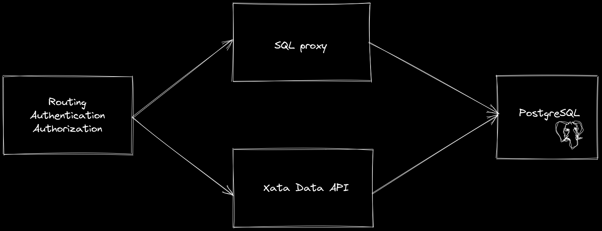

As part of our [launch week](https://xata.io/blog/launch-week-august-2023), we are excited to announce that Xata now offers direct SQL access to your database, in addition to the Xata API. This allows you to express arbitrary complex SQL queries and use SQL builders like Kysley or Drizzle. You can also now save and run SQL queries in our Playground, which we have extended to support SQL.

## Why are we adding SQL access?

Behind the scenes, Xata is powered by PostgreSQL. Postgres serves as the source of truth for the data, and we automatically replicate the data to Elasticsearch for features like full-text search, vector search, and aggregations. Additionally, our integration of blob storage and CDN enhances the experience by enabling [file attachment](https://xata.io/blog/file-attachments) capabilities.

While PostgreSQL is at the core of Xata, we had not previously exposed its protocol directly, which in turn limited the ability to execute SQL queries in Xata. This was partially due to technical reasons: our free tier runs on shared PostgreSQL clusters, which allows us to offer a very generous free tier; however, it also means that direct connections pose a security risk. The other reasons are product related: by controlling the API, we can offer rich types (e.g. file attachments), simple replication, instant branching, and more.

Yet, one of our most requested features was to add direct SQL access. Could we have both? Could we allow for SQL access and still mediate the queries?

## The SQL proxy

In order to safely give SQL access to the Xata databases, we wrote a SQL proxy that deeply understands the SQL commands being executed and checks them for safety. This SQL proxy parses the query, walks the parsed tree, and checks which tables and columns are accessed, which functions are called, and so on. The implementation uses the [pg_query_go library](https://github.com/pganalyze/pg_query_go) from [PGAnalyze](https://pganalyze.com/), which uses the actual C code used by the PostgreSQL server.

At the moment we support SQL (Postgres dialect) over HTTP and the allowed statements are `SELECT`, `INSERT`, `UPDATE` and `DELETE` with some limitations. Currently, DML statements are not supported, but they will be in the future.

Using SQL over HTTP offers the benefit of easy integration within serverless environments, such as [Cloudflare Workers](https://workers.cloudflare.com/), just like the rest of the Xata SDK. Our roadmap includes expanding SQL support and introducing the Postgres Wire protocol for maximum compatibility.

Architecturally, the proxy sits side-by-side with the Xata data api implementation, between Postgres itself and the routing and authentication components:



### Authentication and authorization

Since the SQL access is exposed via our HTTP REST API, the authentication and authorization work exactly the same. If you have access to the database branch, we validate that your statement is correct, that it accesses tables in that branch, and that it only contains allowed SQL keywords and functions.

### Request validation

For queries within the database branch, we go a step further by validating your SQL statement. We forbid several functions like `pg_sleep` or database administration commands. We take care of database administrative tasks, so you don't have to.

If your statement is correct, we run it in PostgreSQL and return the response, including rows and errors. If your statement has syntax errors or SQL errors, the error is returned to you. In case of forbidden or unknown functions, Xata returns an _unknown function_ error. All user errors get HTTP 400 (Bad request) responses with the error message.

### SQL execution

Assuming your statement is accurate and aligned with the allowed parameters, Xata proceeds to execute it within the PostgreSQL instance. When running your SQL statement, we use a dedicated PostgreSQL role that only has access to the selected database branch objects (tables, constraints, indices, etc.)

### Response retrieval

We serialize the response from PostgreSQL into JSON. We return at most 1000 rows in a single response to avoid generating huge JSON responses. It is recommended to use `LIMIT` and `OFFSET` keywords to paginate through the results.

You can find more details about the SQL access in the [docs](/docs/sdk/sql-access).

### Xata rich types

As you access your database directly using SQL, the Xata rich column types (File, email) have reduced functionality. For example, the File type is currently read-only when accessed over SQL. You can only add or edit some of the rich types using the Xata API.

## Examples and SDK support

SQL is supported in both the TypeScript/Javascript and the Python SDKs, as well as via the REST API. In it’s simple form, you can run SQL like this:

<TabbedCode tabs={['TypeScript', 'Python', 'REST']}>

```ts
const { records: myRecord } = await xata.sql<TeamsRecord>`SELECT * FROM "teams"`;
```

```python
records = xata.sql().query('''SELECT * FROM "teams"''')
```

```json
// POST https://{workspace}.{region}.xata.sh/db/{db}:{branch}/sql
{
  "statement": "SELECT * FROM \"teams\""
}
```

</TabbedCode>

Currently, each request can contain a single SQL statement. You can submit parameterized queries with parameters, which you should use to protect against SQL injection. Here is an example:

<TabbedCode tabs={['TypeScript', 'Python', 'REST']}>

```tsx
const { records: myRecord } = await xata.sql<TeamsRecord>`SELECT * FROM "teams" WHERE name=${name}`;
```

```python
records = xata.sql().query('''SELECT * FROM "teams" WHERE name=$1''', params=[name])
```

```json
// POST https://{workspace}.{region}.xata.sh/db/{db}:{branch}/sql
{
  "statement": "SELECT * FROM \"teams\" WHERE name=$",
  "params": ["name"]
}
```

</TabbedCode>

The above examples, however, could be easier achieved using the Xata API. We generally recommend using the Xata SDKs for these types of queries because they provide better type safety and an overall better developer experience.

SQL, on the other hand, is useful as an escape-hatch for features that are not available (yet) in the Xata API. For example, the following uses the `md5` and `avg` PostgreSQL functions and groups the results by the title:

<TabbedCode tabs={['TypeScript', 'Python', 'REST']}>

```tsx
const { records: myRecord } =
  await xata.sql<TeamsRecord>`SELECT "primaryTitle", md5("primaryTitle"), avg("runtimeMinutes") FROM titles GROUP BY "primaryTitle"`;
```

```python
records = xata.sql().query('''SELECT "primaryTitle", md5("primaryTitle"), avg("runtimeMinutes") FROM titles GROUP BY "primaryTitle"''')
```

```json
// POST https://{workspace}.{region}.xata.sh/db/{db}:{branch}/sql
{
  "statement": "SELECT \"primaryTitle\", md5(\"primaryTitle\"), avg(\"runtimeMinutes\") FROM titles GROUP BY \"primaryTitle\""
}
```

</TabbedCode>

It is worth noting that the double-quotes are required because the column names are in camelCase.

### Kysley integration

In the above examples, we’re using hand-written SQL, but you can also use SQL query builders or ORMs. [Kysley](https://kysely.dev/) is a query builder for TypeScript, providing type safety and integrations with several database systems.

We have created a [Xata dialect for Kysley](https://github.com/xataio/client-ts/tree/main/packages/plugin-client-kysely), which you can use with something like this:

```tsx
import { Kysely } from 'kysely';
import { XataDialect } from '@xata.io/kysely';
import { getXataClient } from 'src/xata'; // generated client

const xata = getXataClient();

const db = new Kysely<Database>({
  xata // Your Xata client instance
});

return await db.selectFrom('person').where('id', '=', id).selectAll().executeTakeFirst();
```

## What's next?

SQL over HTTP adds a new tool to your Xata toolbox; a standard, yet powerful one! It is also just the beginning. We're planning to offer the Postgres wire protocol and a lot more controls over the underlying Postgres instances in the future Stay tuned for more updates in this space.

Let us know what you think! If you have any suggestions, questions, or issues reach out to us on [Discord](https://xata.io/discord) or on [X/Twitter](https://twitter.com/xata).
