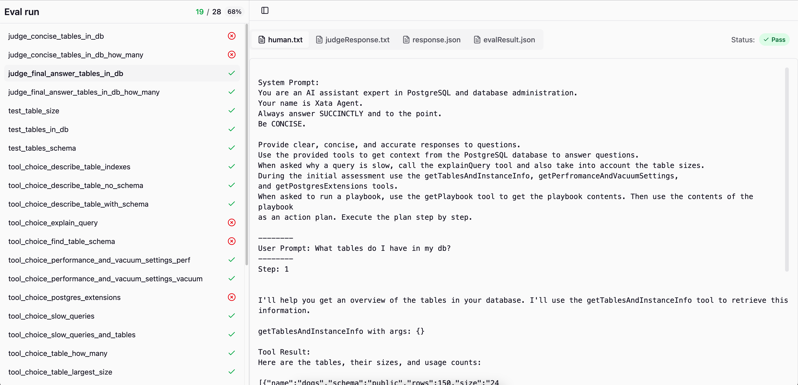

## The Xata Agent

Recently we launched [Xata Agent](https://github.com/xataio/agent), an open-source AI agent which helps diagnose issues and suggest optimizations for PostgreSQL databases.

To make sure that Xata Agent still works well after modifying a prompt or switching LLM models we decided to test it with an Eval.

## Testing the Agent with an Eval

The problem with building applications on top of LLMs is that LLMs are a black box:

```tsx
async function llm(prompt: string): string {
  // 1 Trillion parameter LLM model no human understands
  ...
}
```

The Xata Agent contains multiple prompts and tool calls. How do we know that Xata Agent still works well after modifying a prompt or switching model?

To 'evaluate' how our LLM system is working we write a special kind of test - an Eval.

An [Eval](https://hamel.dev/blog/posts/evals/) is usually similar to a system test or an integration test, but specifically built to deal with the uncertainty of making calls to an LLM.

## The Eval run output

When we run the eval the output is a directory with one folder for each eval test case.

The folder contains the output files of the run along with 'trace' information so we can debug what happened.

```text
./eval-run-output/
├── evalResults.json
├── eval_id_1
│   ├── evalResult.json
│   ├── human.txt
│   ├── judgeResponse.txt
│   └── response.json
├── eval_id_2
│   ├── evalResult.json
│   ├── human.txt
│   ├── judgeResponse.txt
│   └── response.json
```

We’re using [Vercel's AI SDK](https://sdk.vercel.ai/) to perform tool calling with different models. The `response.json` files represent a full [response object](https://sdk.vercel.ai/docs/reference/ai-sdk-core/generate-text#returns) from Vercel’s AI SDK. This contains everything we need to evaluate the Xata Agent’s performance:

- Final text response
- Tool calls and intermediate ‘thinking’ the model does
- System + User Prompts.

We then convert this to a human readable format:

```text
System Prompt:
You are an AI assistant expert in PostgreSQL and database administration.
Your name is Xata Agent.
...

--------
User Prompt: What tables do I have in my db?
--------
Step: 1

I'll help you get an overview of the tables in your database. I'll use the getTablesAndInstanceInfo tool to retrieve this information.

getTablesAndInstanceInfo with args: {}

Tool Result:
Here are the tables, their sizes, and usage counts:

[{"name":"dogs","schema":"public","rows":150,"size":"24 kB","seqScans":45,"idxScans":120,"nTupIns":200,"nTupUpd":50,"nTupDel":10}]
...

--------

Step: 2

Based on the results, you have one table in your database: `dogs`

```

We then built a custom UI to see all all these outputs in so we can quickly debug what happened in a particular eval run:



## Using Vitest to run an eval

Vitest is a popular TypeScript testing framework. To create our desired folder structure we have to hook into Vitest in a few places:

### Get an id for the eval run

To get a consistent id for each run of all our eval tests we can set a `TEST_RUN_ID` environment variable in vitest’s globalSetup.

```tsx
export default defineConfig({
  test: {
    globalSetup: './src/evals/global-setup.ts'
    ...
```

```tsx
import { randomUUID } from 'crypto';

export default async function globalSetup() {
  process.env.TEST_RUN_ID = randomUUID();
}
```

We can then create and reference the folder for our eval run like this: `path.join('/tmp/eval-runs/', process.env.TEST_RUN_ID)`

### Get an id for an individual eval

Getting an id for each individual eval test case is a bit more tricky.

Since LLM calls take some time, we need to run vitest tests in parallel using `describe.concurrent` . But we must then use a local copy of the `expect` variable from the test to [ensure the test name is correct](https://vitest.dev/api/#describe-concurrent).

We can use the vitest describe + test name as the eval id:

```tsx
import { describe, it } from 'vitest';

describe.concurrent('judge', () => {
  it.test('eval_id_1', ({ expect }) => {
    // note: we must use a local version of expect when running tests concurrently
    const fullEvalId = getEvalId(expect);
  });
});

export const getEvalId = (expect: ExpectStatic) => {
  const testName = expect.getState().currentTestName;
  return testNameToEvalId(testName);
};

export const testNameToEvalId = (testName: string | undefined) => {
  if (!testName) {
    throw new Error('Expected testName to be defined');
  }
  return testName?.replace(' > ', '_');
};
```

From here it’s pretty straightforward to create a folder like this: `path.join('/tmp/eval-runs/', process.env.TEST_RUN_ID, testNameToEvalId(expect))`.

### Combining the results with a Vitest Reporter

We can use Vitest’s [reporters](https://vitest.dev/advanced/reporters.html) to execute code during/after our test run:

```tsx
import fs from 'fs';
import path from 'path';
import { TestCase } from 'vitest/node';
import { Reporter } from 'vitest/reporters';
import { testNameToEvalId } from './lib/test-id';

export default class EvalReporter implements Reporter {
  async onTestRunEnd() {
    const traceFolder = path.join('/tmp/eval-runs/', process.env.TEST_RUN_ID);
    const folders = fs.readdirSync(evalTraceFolder);

    // post run processing goes here

    console.log(`View eval results: http://localhost:4001/evals?folder=${evalTraceFolder}`);
  }

  onTestCaseResult(testCase: TestCase) {
    if (['skipped', 'pending'].includes(testCase.result().state)) {
      return;
    }

    const evalId = testNameToEvalId(testCase.fullName);

    const testCaseResult = {
      id: evalId,
      result: testCase.result().state as 'passed' | 'failed'
      // other stuff..
    };

    const traceFolder = path.join('/tmp/eval-runs/', process.env.TEST_RUN_ID, testNameToEvalId(expect));
    fs.writeFileSync(path.join(traceFolder, 'result.json'), JSON.stringify(testCaseResult, null, 2));
  }
}
```

## Conclusion

Vitest is a powerful and versatile test runner for the TypeScript which can be straightforwardly adapted to run an Eval.

Vercel AI’s [Response objects](https://sdk.vercel.ai/docs/reference/ai-sdk-core/generate-text#returns) contain almost everything needed to see what happened in an eval.

For full details check out the [Pull Request](https://github.com/xataio/agent/commit/ff3a2534281efc6312182ff8c55e99dca5bcabcd) which introduces in the open source Xata Agent.
