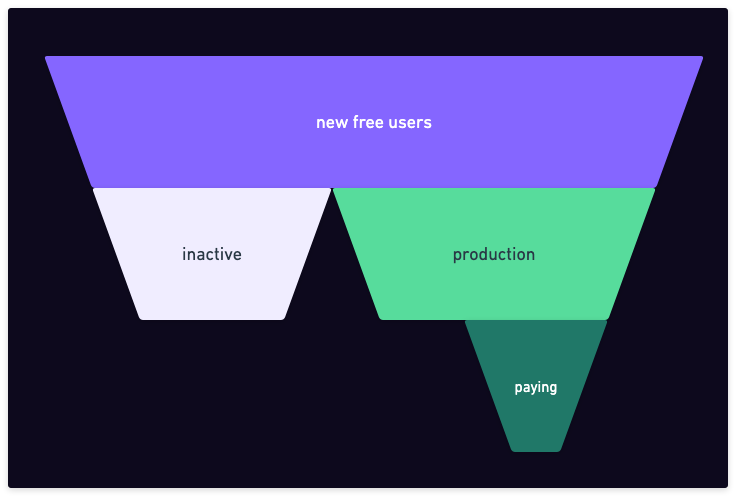
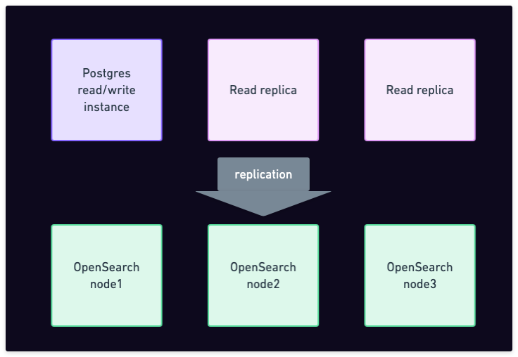

Our free tier doesn't pause databases after a few days, nor does it have cold starts. A database that you might have started two years ago and never touched since will still be there, upgraded to the latest version, instantly serving your queries.

With high-availability included and fully managed and monitored by us, you can count on it just like you count on an online Google spreadsheet or any other SaaS product. But it is a Postgres database, and comes with 15 GB of storage for free.

When we tell people about this, we're often met with disbelief, quite understandably. Ever since PlanetScale have removed their free tier, there has been debate over the sustainability of database free tiers in general. As more and more people are discovering Xata as an alternative for the PlanetScale free tier, it feels right to be open about our economics.

So let's see how we do it and if it's going to bankrupt us.

## Why even have a free tier?

To state the obvious, the goal of a free tier is to ultimately generate paying customers. The cost of the free tier is mostly justifiable as part of the cost of finding new customers, similar to marketing expenses.

A typical funnel looks something like this:

At a high level, from the new users that enter the funnel, some become inactive soon after. That can be because the product didn't meet their needs or that they were simply looking around without an actual project to work on. In order for a free tier to be financially reasonable, it's essential that the cost per "inactive database" is minimal.

Other groups of users are developing their application or project. If that application reaches production, it's likely that they will stay on the platform for a long time.

From those, a portion of them will convert to paying customers. We generally find that teams that go into production want to switch to a paid plan, where they can get dedicated resources and the best support. But there is also a category of individual developers that want a free and reliable database service for their personal side projects. While these individual builders don't always convert to paying users, they do often help by recommending us at work, by spreading the news, or simply by giving us feedback.

It is therefore a balance between offering free users the best possible experience and keeping the costs low enough so that it is sustainable long term.

## How we do it?

We use shared clusters.

This means that we put many (we'll see below how many) free databases on a relatively powerful single Postgres cluster. I say cluster because it's a 3 nodes HA setup with one writer instance and 2 read replicas. That is why HA comes included in the free tier with Xata.

In addition, we pair this Postgres clusters with an OpenSearch clusters to which we automatically replicate the data. This is because we want our free tier to demonstrate not only our Postgres service, but also our **database platform** benefits, and painless replication to a search/aggregations engine is one of them. That's right, the free plan includes not only a Postgres free tier, but also a search engine free tier based on OpenSearch.

The main issue with using shared clusters is the "noisy neighbor" issue. This happens when a free user generates enough load to negatively affect the other users in the same clusters.

We mitigate this by a combination of rate and concurrency limits, vertically scaling up when needed, and moving databases across clusters.

The last one, moving databases between clusters, is particularly important, because it allows us to isolate noisy databases. It also allows us to increase or decrease the "density" of clusters in order to balance the risk of noisy neighbors with the cost. We'll talk more about how we do this in a technical blog post next week, as we'll be releasing a public facing feature that relies directly on it. For now, let's just say that we have the capability to "move" databases from one cluster to another without the connection string having to change and without noticeable downtime.

## The math

Our default Postgres cluster uses `db.t4g.medium` instances, which cost us around $70 per month at on-demand pricing (ignoring reserved instances for now for simplicity). Since we run 3 instances, the cost per month is $210 for the Postgres part. For OpenSearch, we use `r6gd.large.search` instance types, which cost about $140 per month. Again we have 3 nodes, so the cost for the OpenSearch part is $420/month. This means the "BoM" cost for one Postgres+OpenSearch cluster is around $630/month.

At our default "density", which is appropriate for lightly used databases, we put a maximum of 2000 databases on one such cluster. This means that the cost per free database comes down to $630 / 2000 = $0.315 per month. However, the clusters are not necessarily filled uniformly, and we also have other costs: our own processes in front of the database, the replication, monitoring, and so on. Adding it all up, the cost for an "active but lightly used database" is somewhere between $1 and $2.5 per month.

For inactive databases (in our definition, a DB is inactive if it wasn't accessed at all for 30 days), we have a special cluster type with search disabled and using auto-scaling Postgres instances. The base cost of such a cluster is around $180 per month, and it can host up to 20,000 inactive databases. This means that our price inactive database is tiny, measured in cents. Because the cost is so small, we can leave databases on this instance type practically forever, so we don't need to "archive" them.

If one of these inactive databases suddenly becomes active, the instance scales up automatically to handle the load. Then, we'll automatically schedule a task to move the database to an active cluster with lower density.

If you're used to cloud DBaaS pricing, you might have noticed that I omitted something: the above only talks about compute cost, not the storage cost. Storage costs us $0.10 / GB-month, and we offer 15 GB in the free tier, so that can cost us up to $1.5/month, even for inactive DBs. However, in practice, free inactive databases typically don't load that much data and, at least on average, the storage cost is much smaller than that.

## Not only for the free tier

Beyond the free tier, we found that being able to run "many small scale" databases is also valuable for larger-scale use cases like:

- **Database per customer**. You might do this to have a stronger separation between tenants, or because you need different schemas, or because you want to geographically distribute them.
- **Microservices**. Each microservice gets its own database with its own schema to manage. Since moving databases is easy, you can have small DBs on shared clusters, and then "graduate" them to dedicated clusters when needed.
- **Dev branches and preview deployments**. Creating database branches is quick and lightweight, so you can create one for each PR and use it in a preview deployment.

In all of these scenarios, the ability to instantly create databases or branches through a simple API call, with minimal costs at small scale, proves to be extremely convenient. The ability to move them from one cluster to another, without downtime, makes it easier to optimize your underlying instances.

## Conclusion

We went through the unit economics of our free tier. The shared clusters approach, combined with the ability to move logical databases between physical clusters, gives us the flexibility to group databases based on their activity level, mitigating the noisy neighbor problem. While this tech helps us offer a sustainable free tier, it is also a fit for larger use cases.

Are shared clusters the only possible approach for a sustainable free tier? No, other companies are trying other ways. Supabase, for example, are solving the inactive DBs cost by pausing the instance automatically after a few days of inactivity. The same was the case with PlanetScale when they had a free tier. Neon is scaling databases to zero and offers a certain number of "active hours" in their free tier. There are pros and cons to each, but overall, we think our free tier is sustainable and genuinely useful to many use cases, and we love to see what our community is using it for.

Want to check out Xata and increase our bill? Simply [sign up](https://app.xata.io/), it's on us 😅

Psst: Next week is our "Elephant on the move" launch week. Some more cool stuff is coming, so make sure to [stay in the loop](https://x.com/xata)!
