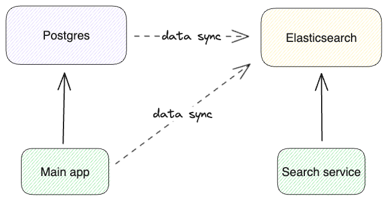
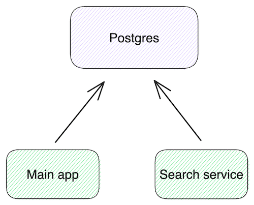
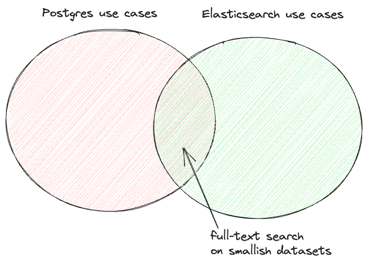

In [Part 1](https://xata.io/blog/postgres-full-text-search-engine), we delved into the capabilities of PostgreSQL's full-text search and explored how advanced search features such as relevancy boosters, typo-tolerance, and faceted search can be implemented. In this part, we'll compare it with Elasticsearch.

First, let's note that Postgres and Elasticsearch are generally not in competition with each other. In fact, it's very common to see them together in architecture diagrams, often in a configuration like this:



In this architecture, the source of truth for the data lives in Postgres, which serves the transactional CRUD operations. The data is continuously synced to Elasticsearch, either via something like Postgres logical replication events (change-data-capture) or by the application itself via custom code. During this data replication, denormalization might be required. The search functionality, including facets and aggregations, is served from Elasticsearch.

While this architecture is as common as it is for very good reasons, it does have a few challenges:

1. Having to deal with two types of stores means more operational burden, and higher infrastructure costs.
2. Keeping the data in sync is more challenging than you might think. I'm planning a dedicated blog for this problem, because it's quite interesting. Let's just say, it's pretty hard to get it completely right.
3. The data replication is, at best, **near** real-time, meaning that there can be consistency issues in the search service.

Point 2 is generally solvable via engineering effort and careful dedicated code. From the existing tools, [PGSync](https://pgsync.com/) is an open source project that aims to specifically solve this problem. [ZomboDB](https://github.com/zombodb/zombodb) is an interesting Postgres extension that tackles point 2 (and I think partially point 3), by controlling and querying Elasticsearch _through_ Postgres. I haven't yet tried either of these two projects, so I can't comment on their trade-offs, but I wanted to mention them.

And yes, a data platform like [Xata](https://xata.io) solves most of points 1 and 2, by taking that complexity and offering it as a service, together with other goodies.

That said, if the Postgres full-text search functionality is enough for your use case, making use of it promises to significantly simplify your architecture and application. In this version, Postgres serves both the CRUD app needs and the full-text search needs:



This means you don't need to operate two types of stores, no more data replication, no more denormalization, no more eventual consistency. The search engine built into Postgres happens to support ACID transactions, joins between tables, constraints (e.g. not null or unique), referential integrity (foreign keys), and all the other Postgres goodies that make application development simpler.

Therefore, it's no wonder the [Hacker News thread](https://news.ycombinator.com/item?id=36699016) for our [part 1 blog post](https://xata.io/blog/postgres-full-text-search-engine) had a lively discussion about the pros and cons of this approach. Can we go for the Postgres-only solution, or does the best-tool-for-the-job argument wins?

We're going to compare the convenience, search relevancy, performance, and scalability of the two options.

## DIY versus built-in

As we showed in part 1, you can replicate a lot of the Elasticsearch functionality in Postgres, even more advanced things like relevancy boosters, typo-tolerance, suggesters/autocomplete, or semantic/vector search. However, it's not always straight forward.

An example where it's not too simple is with typo-tolerance (called fuzziness in Elasticsearch). It's not available out-of-the-box in Postgres, but you can [implement it with the following steps](https://xata.io/blog/postgres-full-text-search-engine#typo-tolerance-fuzzy-search):

- index all _lexemes (words)_ from all documents in a separate table
- for each word in the query, use similarity or Levenshtein distance to search in this table
- modify the search query to include any words that are found

While the above is quite doable, in dedicated search engines like Elasticsearch, you can enable typo-tolerance with a simple flag:

```json
// POST /recipes/_search
{
  "query": {
    "multi_match": {
      "query": "biscaits",
      "fuzziness": 1
    }
  }
}
```

## Search relevancy: BM25 and TF-IDF

The default ranking algorithm for keyword search in Elasticsearch is BM25. With the release of Elasticsearch 5.0 in 2016, it dethroned TF-IDF as the default ranking algorithm. Postgres doesn't support either of them, mainly because its ranking functions (explained in [here](https://xata.io/blog/postgres-full-text-search-engine#tsrank)) don't have access to global word frequency data which is needed by these algorithms. To see how _relevant (pun intended) or_ not so relevant that might be, let's look at the ranking functions and algorithms from simple to complex:

- `ts_rank` (Postgres function) - ranks based on the term frequency. In other words, it does the “TF” (term frequency) part of TF-IDF. The principle is that if you are searching for a word, the more often that word shows up in the matching document, the higher the score. In addition to using simple TF, Postgres provides ways to normalize the term frequency into a score. For instance, [one approach](https://www.postgresql.org/docs/current/textsearch-controls.html#TEXTSEARCH-RANKING) is to divide it by the document length.
- `ts_rank_cd` (Postgres function) - rank + cover density. In addition to the term frequency, this function also takes into account the “cover density”, meaning the proximity of the terms in the document.
- TF-IDF - term frequency + inverse document frequency. In addition to the term frequency, this algorithm “penalizes” words that are very common in the overall data set. So if the word “egg” matches, but that word is super common because we have a recipes dataset, it is valued less compared to other words in the query.
- BM25 - this algorithm is based on a probabilistic model of relevancy. While the [TF-IDF formula](https://lucene.apache.org/core/8_8_0/core/org/apache/lucene/search/similarities/TFIDFSimilarity.html) is mostly based on intuition and practical experiments, BM25 is the result of more [formal mathematical research](https://www.staff.city.ac.uk/~sbrp622/papers/foundations_bm25_review.pdf). If you're curious about the said mathematical research, I recommend this [talk](https://www.elastic.co/elasticon/conf/2016/sf/improved-text-scoring-with-bm25) that makes it accessible. Interestingly, the resulting BM25 formula is not all that different from TF-IDF but it incorporates a couple more concepts: the frequency saturation and the document length. Ultimately, this gives better results over a wider range of document types.

There's no question that BM25 is a more advanced relevancy algorithm than what `ts_rank` or `ts_rank_cd` use. BM25 uses more input signals, it's based on better heuristics, and it typically doesn't require tuning.

One practical effect of BM25 is that it automatically penalizes the very common words (”the”, “in”, “or”, etc.), also called “stop words”, which means that they don't need to be excluded from the index. This is why the Postgres `english` configuration for `to_tsvector` removes the stop words (details [here in part 1](https://xata.io/blog/postgres-full-text-search-engine#tsvector)), but the Elasticsearch [standard analyzer](https://www.elastic.co/guide/en/elasticsearch/reference/current/analysis-standard-analyzer.html) doesn't. It doesn't need to.

While BM25 is superior, there are some pro-Postgres arguments to be considered:

- if you aggressively exclude the stop words, like the `english` configuration in Postgres does, that compensates for the lack of IDF in some cases.
- in practice there might be stronger signals of relevancy in the data itself (upvotes, reviews, etc). See the [section on boosters from part 1](https://xata.io/blog/postgres-full-text-search-engine#numeric-date-and-exact-value-boosters) on how to make use of them in Postgres.

Could BM25 or TF-IDF be implemented on top of the existing Postgres functionality? Actually, yes. See this [blog post](https://www.alibabacloud.com/blog/keyword-analysis-with-postgresql-cosine-and-linear-correlation-algorithms-for-text-analysis_595793) that uses `ts_stats` and `ts_debug` to compute TF-IDF. It's not very simple, but possible (as usual with Postgres).

## Performance and scalability considerations

Let's start by noting that the two systems couldn't be more different:

- PostgreSQL has a single master and multiple read replicas, Elasticsearch has horizontal scalability via sharding.
- Postgres is relational, supports joining tables, has ACID transactions, and offers constraints, while Elasticsearch is document oriented and offers consistency guarantees only per document.
- Postgres is row oriented, while Elasticsearch has an internal column store in the form of [doc values](https://www.elastic.co/guide/en/elasticsearch/reference/current/doc-values.html).
- Postgres is native C code, while Elasticsearch runs on the JVM.
- Postgres has a connection-oriented wire protocol, while Elasticsearch has a REST-like DSL over HTTP.

All of these impact performance and scalability, and it's no surprise then that the two tend to shine in different areas: PostgreSQL is commonly used as a primary data store, whereas Elasticsearch is usually utilized as a secondary store, particularly for search and analytics on time-series data such as logs. And yet, they do overlap on the use case of full-text search, which is the point of this blog post.



I was curious to know at roughly what amount of data Postgres slows down compared to Elasticsearch. On the movies dataset (34K rows) that we used in part 1, all queries were reasonably fast (\<300 ms). So for the testing here, I chose a larger data set: a recipes dataset from Kaggle, containing [2.3M recipes](https://www.kaggle.com/datasets/wilmerarltstrmberg/recipe-dataset-over-2m?resource=download). The commands to load the CSV file in PostgreSQL can be found in this [gist](https://gist.github.com/tsg/bc64fcea28fca844db11c65b9b1cb4ca). For Elasticsearch, I've loaded the same CSV file using this [tool](https://github.com/ovidiugiorgi/csv2opensearch).

After loading the data, I started by running searches similar to the ones used in part 1:

```sql
SELECT title, ts_rank(search, websearch_to_tsquery('english', 'darth vader')) rank
   FROM recipes WHERE search @@ websearch_to_tsquery('english','darth vader')
   ORDER BY rank DESC limit 10;
        title         |    rank
----------------------+------------
 Darth Vader Biscuits | 0.09910322
 Cloud 9 Pancakes     | 0.09910322
(2 rows)

Time: 100.468 ms
```

For Elasticsearch I've used the following to run the search:

```json
// POST /recipes/_search
{
  "query": {
    "query_string": {
      "query": "darth AND vader"
    }
  }
}
```

I ran each query five times and recorded the best and worst times. Typically, the first query of a kind was the slowest because the following queries benefited from having the relevant pages already in memory. While this approach is rather unscientific, and you should conduct your own benchmarking on your data before drawing definitive conclusions, it should be sufficient for drawing some initial conclusions.

Here are the results on a few queries:

| query | Elasticsearch || Postgres ||
| | worst time (ms) | best time (ms) | worst time (ms) | best time (ms) |
| --- | --- | --- | --- | --- |
| darth vader | 52 | 4 | 100 | 3 |
| chicken nuggets | 85 | 10 | 313 | 13 |
| pancake | 60 | 4 | 618 | 157 |
| curacao | 286 | 7 | 230 | 10 |
| mix | 67 | 5 | 25182 | 8267 |

As you can see, Postgres performs well on some queries such as "darth vader" or "curacao," responding within milliseconds. However, on other queries like "pancake" or "mix," it performs significantly worse than Elasticsearch, with response times measured in seconds. It gets as bad as 25 seconds latency! What's going on here?

The difference lies in how many rows match the query terms. Searching for “darth vader” in a recipes dataset matches 2 rows. But searching “mix” in a recipes dataset matches a million rows (literally, 1,038,914 to be precise). Since we order by rank, Postgres needs to call the `ts_rank` function for each of the million rows. The Postgres docs even [warn about this](https://www.postgresql.org/docs/current/textsearch-controls.html#TEXTSEARCH-RANKING):

> Ranking can be expensive since it requires consulting the `tsvector` of each matching document, which can be I/O bound and therefore slow. Unfortunately, it is almost impossible to avoid since practical queries often result in large numbers of matches.

Indeed, the issue is from ranking. If we're only interested in matching and we order by an (indexed) column, it is fast:

```sql
SELECT title FROM recipes
  WHERE search @@ websearch_to_tsquery('english','mix')
  ORDER BY title ASC LIMIT 10;

Time: 24.681 ms
```

But we're working on the assumption that ranking is necessary for a good search experience. One idea is to use what I call "sampling": before computing the ranks, take a sample of 10K rows that match. The assumption is that if your query matches so many documents, the ranking is likely to be ineffective anyway, so it's better to prioritize the response time.

The SQL to do this looks like this:

```sql
WITH search_sample AS (
	SELECT title, search FROM recipes
  WHERE search @@ websearch_to_tsquery('english','mix')
  LIMIT 10000)
SELECT title, ts_rank(search, websearch_to_tsquery('english', 'mix')) rank
  FROM search_sample
  ORDER BY rank DESC limit 10;
```

Re-running the tests with this sample approach gives us closer results:

| query | Elasticsearch || Postgres ||
| | worst time | best time | worst time | best time |
| --- | --- | --- | --- | --- |
| darth vader | 52 | 4 | 100 | 3 |
| chicken nuggets | 85 | 10 | 195 | 14 |
| pancake | 60 | 4 | 145 | 13 |
| curacao | 286 | 7 | 225 | 11 |
| mix | 67 | 5 | 400 | 144 |

Much better! Of course, we did sacrifice on the relevancy, which might or might not be ok in your case.

Here are some conclusions and more considerations on the topic of performance and scalability:

- on search use cases over smaller datasets (\<100K rows) both systems will perform well, but a Postgres-only solution will require less resources.
- on medium datasets (a few million rows), Elasticsearch is already faster, however, Postgres can perform within a 200ms latency budged if you use the sampling trick explained above.
- when the number of documents is really large, for example logs or other time series, Elasticsearch has the additional advantage of horizontal scalability.
- if you need a lot of aggregations or analytics (e.g. display a dashboard full of graphs) and the data set is large enough, Elasticsearch's columnar store will give it an advantage.
- giving Postgres an extra workload can affect the performance of your main instance. The solution is to move the searching to a replica, but then you lose some of the consistency guarantees.

## Semantic and hybrid search

Both part 1 and this blog post were focused on keyword searching techniques. However, in the last few years, semantic / vector search has taken the world of search by storm, so I feel like I need to touch on this aspect as well in comparing the two.

Semantic search leverages language models to generate embeddings for each document. Embeddings are arrays of numbers that represent the text on a number of dimensions. Pieces of text that have similar embeddings have a similar _meaning_. In other words, semantic search can “search by meaning”, rather than “by keywords”. This is quite exciting now, because large language models (LLMs) give us very accurate understanding of meaning. It means you don't have to maintain list of synonyms or add different keywords to your documents to match how your users are searching.

Postgres supports vector search via the [pgvector](https://github.com/pgvector/pgvector) extension, while Elasticsearch has it built-in via the [KNN search](https://www.elastic.co/guide/en/elasticsearch/reference/current/knn-search.html). You can find benchmarks on [ann-benchmarks](https://ann-benchmarks.com/index.html) (look for `pgvector` and `luceneknn`) but keep in mind that both implementations are under active development and their performance is being improved.

While exciting, it turns out that semantic search alone doesn't really work great on the typical search experiences that we have today, at least not on a majority of datasets. If you are curious, I recently wrote a [comparison between keyword and semantic search](https://xata.io/blog/keyword-vs-semantic-search-chatgpt) for the particular use case of selecting the context for ChatGPT.

For search use case like the recipes one in this blog post, hybrid search might give better results: use a combination of keyword and semantic search to improve the ranking.

Elastic has recently announced their “[Elasticsearch Relevance Engine](https://www.elastic.co/blog/may-2023-launch-announcement)”, which includes hybrid search. In Postgres, given that it's all building blocks, you can combine the full-text search functionality and pgvector. I'm looking forward to diving deeper into this topic as well, but I'll leave that for a follow-up blog post.

## Conclusion

Choosing between a Postgres-only architecture and a Postgres + Elasticsearch architecture will depend on your use case and scale.

For example, if you have a table or list in your application on which you support CRUD operations and you want to add full-text search functionality to it, Postgres will likely work well for you for quite some time.

On the other hand, if you have a large data set search and search relevancy is critical to your application (for example, in e-commerce), using a dedicated search engine like Elasticsearch is going to perform better both in latency and relevancy.

In many cases, it might make sense to start with the simpler Postgres-only approach, but be ready to pivot to the Postgres + Elasticsearch architecture when needed.

If you read this far, you might want to give [Xata a try](https://xata.io/). It offers both Postgres and Elasticsearch in the same data platform, and can also handle the syncing between them with no extra effort. If you have any feedback on this blog post, or are interested in the follow-up blog posts, you can follow us on [Twitter](https://twitter.com/xata) or join us in [Discord](https://xata.io/discord).
