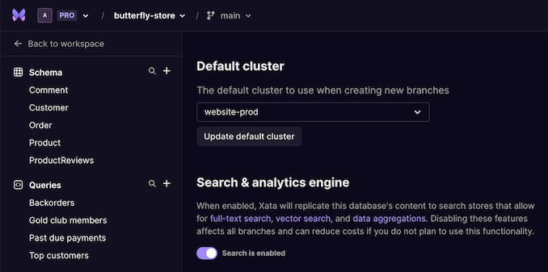
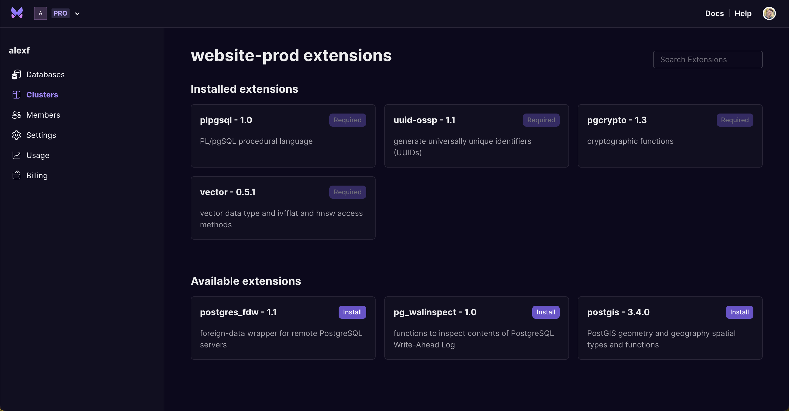
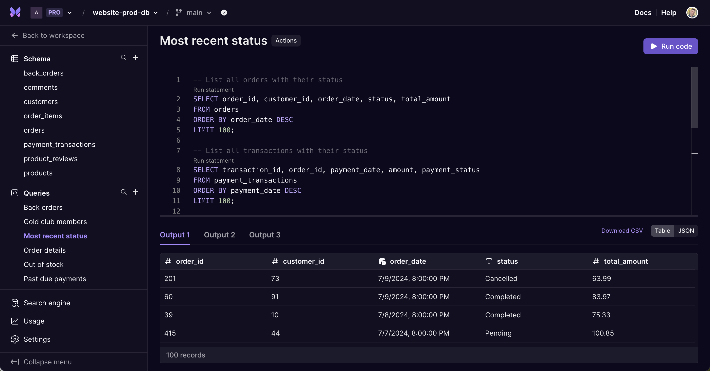

Earlier this year we announced our [serverless Postgres platform](https://xata.io/blog/serverless-postgres-platform) and an early access program for [dedicated clusters](https://xata.io/blog/postgres-dedicated-clusters). Both of these offerings are core to Xata's evolution to becoming a Postgres database platform for faster development and a worry-free data layer. Serverless Postgres unlocks decades worth of community, tooling and support for our customers. While dedicated clusters provide more predictable costs, better performance and a more scalable solution for large production workloads. The two pair perfectly together, and we'll be diving into what's new in this blog.

We're extremely excited to announce the next milestone in this evolution, a public beta for dedicated clusters! 🎉

Before diving into the specifics, we want to whole-heartedly thank our EAP customers for not only being early adopters, but providing amazing levels of feedback throughout the journey. Keep a look out, you'll all be receiving some premium Xata swag soon 💜

## What is a dedicated cluster?

Today, most of Xata databases live in a shared cell architecture. Our multi-tenant cells include a Postgres Aurora cluster, an Elasticsearch cluster, high availability built in and all the APIs and services required for development. Within each cell, we split the system for each workspace to include about 2,000 active databases per cell before we have to spin up a new one. Unless you were an EAP customer, your Xata database is using this shared cell architecture.

Our dedicated clusters are essentially, dedicated cells. So you have all the same benefits of the shared cell architecture, with less limitations caused by shared resources, more control over your infrastructure, decoupled usage based pricing and the confidence that Xata can scale with your business.

I won't dive too much into the specifics here, but if you're interested in learning more, [this blog](https://xata.io/blog/postgres-dedicated-clusters) and [our documentation](https://xata.io/docs/dedicated-cluster) are great resources.

## Celebrating with a limited-time offer

To kick off this [launch week](https://xata.io/launch-week-elephant-on-the-move) right and celebrate our public beta release, we will be offering **$1,000 in credit** for customers that start using dedicated cluster between now and its general availability later this year. This credit will be good through the end of 2025, but you will only have a few months to qualify. As a customer, you do not need to apply for the credit. Any usage from a dedicated cluster will automatically be deducted and you have full control over what the deployment looks like.

If you're already a happy Xata customer, you can easily move all of your databases or a single branch to a dedicated cluster in just a few clicks.

## What's new

The team has been hard at work over the last few months building out features and functionality to provide the best experience to our beta customers. Starting today you can spin up dedicated Postgres cluster classes ranging in size from `db.t4g.medium` to `db.r6g.2xlarge` in both `us-east-1` and `eu-central-1`. We plan to introduce more classes, versions, regions and extensions in the coming months, so [please let us know](https://xata.io/discord) what you'd like to see.

Here are just some of the many features and functionality available starting today.

### Customize for your use case

Whether you're provisioning a new cluster or editing the one you already have, there are numerous configuration options to make sure you have the appropriate infrastructure for your use case.

Today, our Postgres databases are [Amazaon Aurora instances](https://aws.amazon.com/rds/aurora/) so you can trust that your database will have the scalability, reliability and security that AWS is known for. With dedicated clusters you can configure both the Postgres engine version, cluster class and number of replicas for faiover and query distribution.

Autoscaling is a great option to consider if you expect variable usage of your application and database. This will scale up or down as needed, with a simple capacity range you can define so you do not incur any unexpected costs.

Weekly maintenance windows and daily backup windows can be defined, with full control over when updates and version upgrades are applied.

Most of the configuration options we provide will impact the monthly cost, and there is a very simple estimated monthly cost presented to you before you provision the cluster.

As we look ahead, we plan to provide templates that include infrastructure and confiugration best practices for specific use cases.

### Defining a default cluster

After a dedicated cluster has been created, you can select it as the default option for a database on creation or through the database settings.

When you choose a default cluster, any new branch within that database will automatically be created there. This is perfect for development workflows that use branching for staging environments or pull request based development. Your dedicated cluster could only be for your production database, while each branch created could be automatically created in a shared cluster or a dedicated development cluster.

### Visibility into usage of your cluster

Every dedicated cluster has an overview page, where you can get a sense of what the usage of your infrastructure looks like and where the bottlenecks may be occurring. This view provides visibility into CPU utilization, database connections, freeable memory, storage, receive and transmit throughput and read/write IO.

These are not only useful for monitoring usage, but will give you a sense for what the usage will cost on top of the dedicated infrastructure. For more details around the what the pricing looks like for dedicated clusters, you can look at our [pricing page](https://xata.io/pricing).

### Extensions now supported

One of the drawbacks (and reasons for building dedicated clusters) is that shared clusters, while useful for most projects, have certain limitations because of the shared resources. There are simply more security precautions for every new supported piece of functionality we have. So naturally, we cannot provide the same [supported extensions](https://xata.io/docs/postgres#extensions) in shared clusters as we can in dedicated clusters.

We've started adding Postgres extensions based on popularity amongst our user base, starting with `plpgsql`, `uuid-ossp`, `pgcrypto`, `vector`, `postgres_fdw`, `pg_walinspect` and `postgis`. We will continue to grow this library of extensions over time, but please let us know if there's one missing you'd like to see.

### Move branches between clusters

One of the most powerful features that come with this beta release, is the ability to move branches between clusters. You are able to take your main database or one of the branches and move it to another cluster in just a few clicks. We are using this internally to provide a forever-free tier, automatically moving inactive databases to a special cell meant for longer term storage and moving it back to an active cell if re-activated. Our CTO, [Tudor Golubenco](https://www.linkedin.com/in/tudorgolubenco/), dives into the economics of our free tier and the techncial details behind it in [this blog](https://xata.io/blog/postgres-free-tier).

That is one internal use case for this functionality, but it opens up many possibilities for blue-green deployments, testing / developer environments and database management with zero downtime. [Stay tuned](https://x.com/xata), we'll dive into these use cases specifically later this week.

## Serverless Postgres, the SQL

Get it? Sorry, I had to to lead with the dad-joke. It was just too easy. And yes, I know it's been done -- I just couldn't help myself. We're big on dad(and mom)-jokes at Xata.

As you'll soon seen, dedicated clusters has only been a portion of our focus since our [last launch week](https://xata.io/launch-week-unleash-the-elephant). We've also spent time improving our Postgres offering, the tooling around it and better supporting the use cases and workflows our customers have been asking for.

Today we're not only announcing the public beta for dedicated clusters, but also opening up access to enable direct access to Postgres as part of our database creation workflow 🥳

Over the last few months, the interest we've seen and the feedback we've received has been overwhelming. Again, we can't thank you enough to our early adopters 🦋

### Even more compatible with your favorite clients and tooling

The team has been hard at work making sure that our serverless Postgres offering works with the ORMs and tooling you know and love.

We've put a special focus on making sure [Drizzle](https://orm.drizzle.team/), [Prisma](https://www.prisma.io/), [SQLAlchemy](https://www.sqlalchemy.org/) and [Django](https://www.djangoproject.com/) ORMs work well with our platform. Common administrative and data exploration tools like [DataGrip](https://www.jetbrains.com/datagrip/), [pgAdmin](https://www.pgadmin.org/) and [TablePlus](https://tableplus.com/) have been put through the wringer to resolve any compatability hiccups seen over the past few months.

With recent support for multiple schemas and operations, and a configureable `search_path`, our offering is now much more compatible with a growing set of clients and tools. Our [list of supported statements](https://xata.io/docs/postgres#supported-statements) continues to grow, and we aim to maximize compatability in both shared and dedicated clusters in the coming months.

### Playground upgraded to Queries

Outside of the table editor, the most popular part of our application is the Playground. And we've seen significant growth in this workflow for SQL queries over the past year. With this release, we're upgrading the Playground to Queries. Queries will be much more prominent in the navigation, making it really easy to navigate to your favorite query. You can still run TypeScript and Python code, but we've significantly improved the SQL experience.

Previously, the output had only been JSON. We now default to a table view. You can run multiple query statements at once, automatically creating tabs for each of the outputs. All queries are persisted serverside, so they're ready for re-use wherever you are.

This is just the beginning for queries. We plan to do much more here. Providing a table with feature parity to the editor, the ability to favorite or pin queries and eventually, make them shareable between users in your workspace. Keep on eye on this view, we'll be incrementally improving over time. If you have a specific feature request, feel free to [drop it in here](https://xata.canny.io/feature-requests).

## Join in on the fun this week

Want to see dedicated clusters in action? Check out this quick demo video.

<ArticleVideo platform="youtube" src="https://www.youtube.com/embed/5PtAeNkKGCE?si=PNX2ws8dI_-mBl9G" />

If you haven't tried out our serverless Postgres offering yet, it's really easy to get started. Simply [sign up for Xata](https://app.xata.io/signup), use `pg_dump` to export your existing database and `pg_restore` to [import into Xata](https://xata.io/docs/postgres#import).

You can follow along with a new announcement every day on our [launch week page](https://xata.io/launch-week-elephant-on-the-move), join in on our [summer hackathon](https://xata.io/blog/summer-launch-pxci-hackathon) or just [pop into Discord](https://xata.io/discord) and say hi 👋

However you choose to participate, thank you for your support and we can't wait to see what you build 🦋
