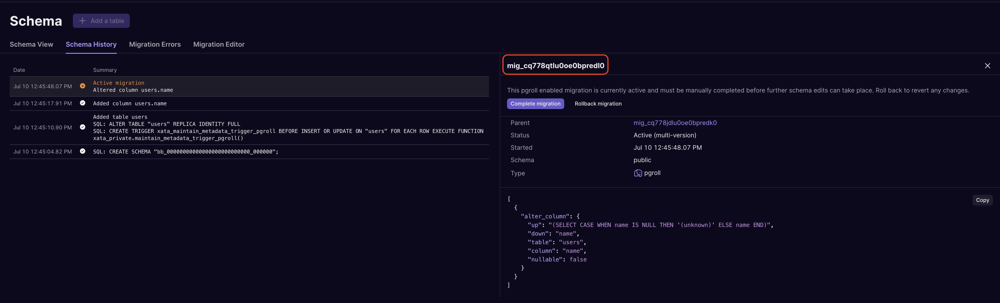

Today we are excited to announce multi-version schema migrations in Xata 🎉

Multi-version schema migrations tackle one of the most painful aspects of application deployment: keeping your application code and database schema in sync.

Multi-version schema migrations allow both the old and new versions of your database schema to be live and accessible during a schema migration. This greatly simplifies deployment of your applications as both the currently deployed and the new version of your application see the version of the database schema that they expect. And because both versions of the database schema are live at the same time, rollbacks become trivial.

Behind the scenes, Xata does the heavy-lifting to make this work by presenting different versioned views of your application schema to each version of your application. It then transparently migrates data between the old and new versions of your database schema as data is written to each version.

# Application rollouts and database schema changes

Rolling out changes to applications in production can be complicated and error prone when there are also database schema changes required to support a new version. During the deployment of the new application version, there will be a period during which both old and new versions of the application are live simultaneously.


Developers have to carefully consider how the two application versions will be able to run simultaneously while the rollout is in progress. This has led to the rise of complicated multi-step workflows for performing simple schema changes, such as PlanetScale's [six-step guide](https://planetscale.com/docs/learn/handling-table-and-column-renames#how-to-rename-a-column-on-planetscale) for performing a column rename operation.

Wouldn't it be easier if you could keep both the old and new versions of your database schema live at the same time during a schema migration and have applications connect to the right version?

# Multi-version schema migrations in Xata

Multi-version schema migrations in Xata allow you to start a migration from Xata and have both versions of your database schema available to applications for the duration of the migration. When your application rollout is complete, the migration can be completed leaving you with just the final version of your database schema.

Let's take a look at how this works in practice.

First, we'll create a table in a fresh database, populate it with some data and then create a migration to add a `NOT NULL` constraint to a column in the table. We'll see how multi-version schema migrations allow two versions of the database schema, one with the constraint and one without, to be made available to applications.

## Creating the schema

We'll use Xata to:

- Create a simple `users` table with a `name` column
- Populate the table with some random data

In a new Xata database (with Postgres access enabled), we can create a new table in the application and populate it with some random data:


With the table and data in place, we can create a migration to add a `NOT NULL` constraint to the `name` column.

## The migration editor

The migration editor is used to apply migrations to the database schema. Migrations in Xata use [pgroll](https://github.com/xataio/pgroll), our open-source migration library, under the hood so the format of the migration is a JSON object that describes the changes to be made to the database schema.

We'll create a migration to add a `NOT NULL` constraint to the `name` column in the `users` table. The migration to do so looks like this:

```json
[
  {
    "alter_column": {
      "table": "users",
      "column": "name",
      "nullable": false,
      "up": "(SELECT CASE WHEN name IS NULL THEN '(unknown)' ELSE name END)",
      "down": "name"
    }
  }
]
```

The SQL expression in the `up` field is used to migrate data from the old version of the `name` column that did not have the `NOT NULL` constraint to the new version of the column that does. This means the SQL expression needs to describe what to do with any `NULL` values that may already exist in the `name` field; here we are going to rewrite any `NULL`s to a placeholder value of `(unknown)`. Any non-`NULL` values are copied over to the new version of the `name` column without modification.

The `down` SQL expression does the opposite; it describes how values written to the new version of the `name` column will be migrated back to the old version of the column. Here we simply copy the value without modification.

Arbitrary transformations can be applied to the data during the migration, allowing for complex data migrations to be performed as part of the schema migration.

We can take this migration and run it via the Migration Editor:


Once the migration is started, the table UI shows that we have two versions of the `name` column in the `users` table, one with the `NOT NULL` constraint and one without (this is the [expand/contract pattern](https://blog.thepete.net/blog/2023/12/05/expand/contract-making-a-breaking-change-without-a-big-bang/) in practice):


The new version of the `name` column has been filled with the data from the old version of the column. Had there been any `NULL` values in the column, these would have been rewritten by the `up` data migration we specified in the migration file. The two versions of the `name` column are always kept in sync for the duration of the migration; as data is written into either one, it is migrated to the other using the `up` and `down` SQL expressions from the migration file.

The migration is now in progress and the two versions of the database schema are live and available to applications.

## Connecting to each schema version

In order to be able to take advantage of multi-version schema migrations, applications need to be able to connect to the correct version of the database schema. This is done using the Postgres [search_path](https://www.postgresql.org/docs/current/ddl-schemas.html#DDL-SCHEMAS-PATH) setting. The `search_path` setting determines which schema will be searched for non-schema-qualified table access. By setting the `search_path` appropriately, client applications can access the version of the database schema that is compatible with the deployed application code.

Applications connect to a Xata database using a connection string:

```
postgresql://<YOUR_WORKSPACE_ID>:<YOUR_API_KEY>@us-east-1.sql.xata.sh/exampledb:main?sslmode=require
```

With the connection established, the application can now read and write data to the database using the correct version of the database schema by setting the `search_path` for the session. For example:

```
SET search_path TO <migration name>;
```

The name of the migration to use is the name of the active migration, which can be found in the schema history of the branch:



By setting the `search_path` to the name of the either the current version of the database schema or the previous version, an application can access the appropriate version of the database schema.

In the following example session, we can switch the `search_path` back and forth between the two versions and see how reads work from each version of the schema:

```sql
-- Work with the new version of the schema:
SET search_path TO mig_cq778qtlu0oe0bpredl0;

-- Retrieve the data from the `users` table
SELECT * FROM users ORDER BY name;

-- +--------------------------+----------------------+
-- | xata_id                  | name                 |
-- |--------------------------|----------------------|
-- | rec_cq7v4a18fe4f6dj1qjeg | as until             |
-- | rec_cq7v4a18fe4f6dj1qjhg | beautify ragged      |
-- | rec_cq7v4a18fe4f6dj1qjag | because up           |
-- | rec_cq7v4a18fe4f6dj1qj90 | cruelly oof          |
-- | rec_cq7v4a18fe4f6dj1qjbg | distant queasy       |
-- ...

-- Work with the old version of the schema:
SET search_path TO mig_cq778jdlu0oe0bpredk0;

-- Retrieve the data from the `users` table
SELECT * FROM users ORDER BY name;

-- +--------------------------+----------------------+
-- | xata_id                  | name                 |
-- |--------------------------|----------------------|
-- | rec_cq7v4a18fe4f6dj1qjeg | as until             |
-- | rec_cq7v4a18fe4f6dj1qjhg | beautify ragged      |
-- | rec_cq7v4a18fe4f6dj1qjag | because up           |
-- | rec_cq7v4a18fe4f6dj1qj90 | cruelly oof          |
-- | rec_cq7v4a18fe4f6dj1qjbg | distant queasy       |
-- ...
```

Both versions of the schema show the same data in their view of the `users` table - the data migration that was specified in the migration has kept the two in sync.

Next, we'll see how writes into each version of the schema work, particularly when a `NULL` value is written into the `name` field.

```sql
-- Switch back the new schema, which disallows `NULL`s in the `name` field
SET search_path TO mig_cq778qtlu0oe0bpredl0;

-- Attempt to insert a `NULL` value in the name field
INSERT INTO users(name) VALUES (NULL)
-- ERROR null value in column "name" of relation "users" violates not-null constraint

-- Switch back the old schema, which allows `NULL`s in the `name` field
SET search_path TO mig_cq778jdlu0oe0bpredk0;

-- Attempt to insert a `NULL` value in the name field
INSERT INTO users(name) VALUES (NULL)

-- Retrieve the data from the `users` table
SELECT * FROM users ORDER BY name DESC;

-- +--------------------------+----------------------+
-- | xata_id                  | name                 |
-- |--------------------------|----------------------|
-- | rec_cq7v88tqrj67kk4bk9l0 | <null>               |
-- | rec_cq7v4a18fe4f6dj1qj8g | yuck frantically     |
-- | rec_cq7v4a18fe4f6dj1qjf0 | worriedly disclose   |
-- | rec_cq7v4a18fe4f6dj1qjj0 | weaponize well-to-do |
-- | rec_cq7v4a18fe4f6dj1qjcg | tensely drafty       |
-- ...

-- Switch back the new schema
SET search_path TO mig_cq778qtlu0oe0bpredl0;

-- Retrieve the data from the `users` table
SELECT * FROM users ORDER BY name DESC;

-- +--------------------------+----------------------+
-- | xata_id                  | name                 |
-- |--------------------------|----------------------|
-- | rec_cq7v4a18fe4f6dj1qj8g | yuck frantically     |
-- | rec_cq7v4a18fe4f6dj1qjf0 | worriedly disclose   |
-- | rec_cq7v4a18fe4f6dj1qjj0 | weaponize well-to-do |
-- | rec_cq7v88tqrj67kk4bk9l0 | (unknown)            |
-- | rec_cq7v4a18fe4f6dj1qjcg | tensely drafty       |
-- ...
```

In the old version of the schema, the `name` field allows `NULL` values, so the `INSERT` statement succeeds and reads from the table show the new row with a `NULL` value in the `name` field. When the same data is read in the new version of the schema, the same row has the placeholder value of `(unknown)` that was defined in the migration.

This example session shows that two applications, connected to the same database but with their `search_path` set to different versions, are subject to different constraints and can have different views of the same data.

## Completing a migration

Once the application rollout is complete and all applications have been updated to the new version, the migration can be completed. Completing a migration means that the old version of the database schema is removed, leaving only the new version.

> Once a migration is completed, it cannot be rolled back. Before completing a migration, make sure that all applications that depend on the old version of the schema have been updated to the new version so that the old version of the database schema is no longer required.

Completing an in-progress migration can be done from various places in Xata, including the migrations widget on the dashboard:


Once completed, the table shows just one version of the `name` column in the `users` table again:


## Rolling back a migration

Because multi-version schema migrations use the expand/contract pattern to apply schema changes, rollbacks become much easier. The old version of the database schema was never removed so a rollback means simply removing the expanded parts of the database schema (the new version of the `users.name` column in our example).

Like completing a migration, a migration can be rolled back from the migrations widget on the dashboard:


Once the migration is rolled back, the new version of the `name` column is removed from the `users` table and the database schema and data is in the same state as it was before the migration started.

> Only active migrations can be rolled back; once a migration has been completed, it cannot be rolled back.

# Conclusion

Multi-version schema migrations simplify one of the most common pain points when deploying applications: keeping the deployed versions of your applications and the database schema in sync.

This new feature allows you to deploy your applications and make database schema changes independently and with confidence.

We are excited to share this with you and look forward to your feedback! Want to see multi-version schema migrations in action? Check out this quick demo video.

<ArticleVideo platform="youtube" src="https://www.youtube.com/embed/TwK6-jWVkq4?si=JDAQh_pKWC-yUzYc" />

[Sign up for free today](https://xata.io/start-free). You can follow along this week with a new announcement every day on our [launch week page](https://xata.io/launch-week-elephant-on-the-move), join in on our [summer hackathon](https://xata.io/blog/summer-launch-pxci-hackathon) or just [pop into Discord](https://xata.io/discord) and say hi 👋
