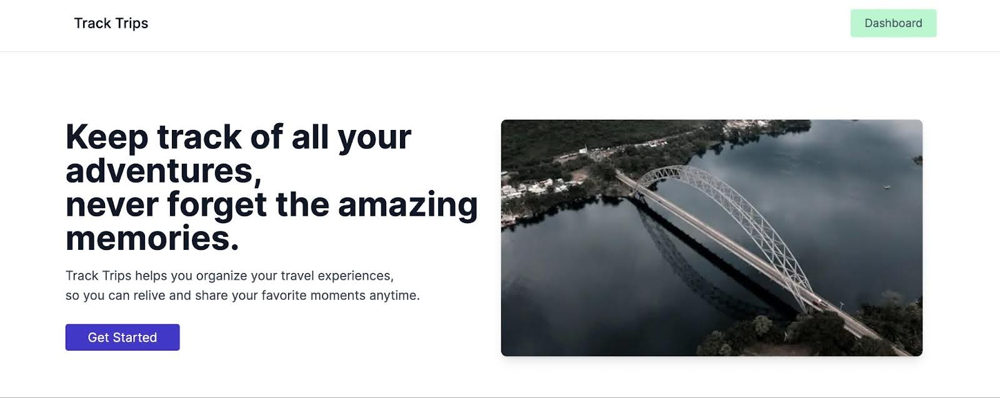
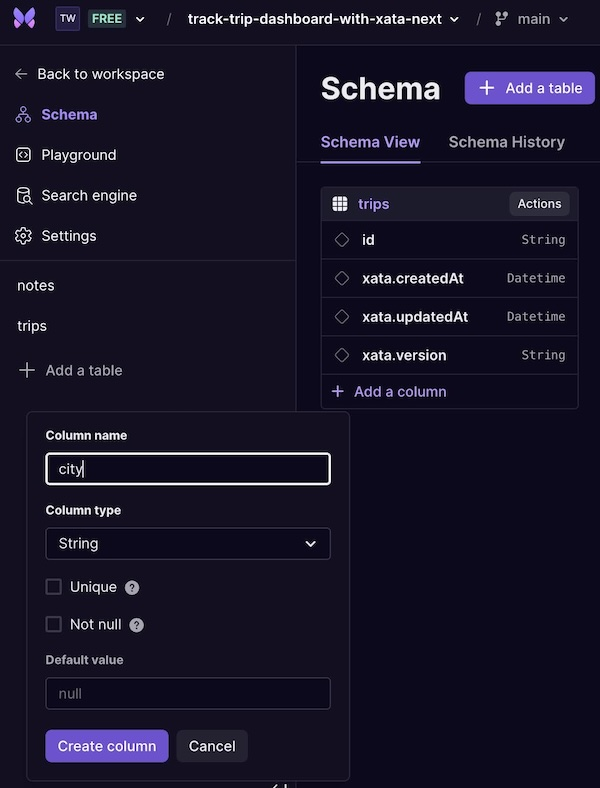
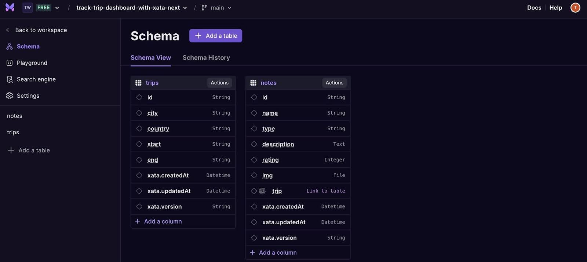
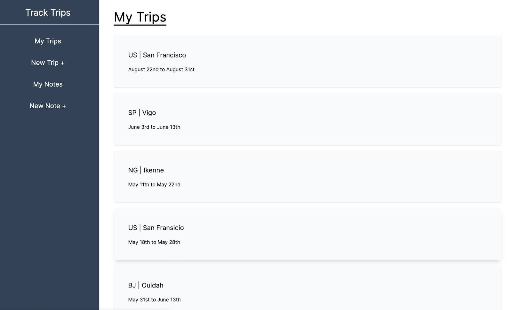

In this step-by-step guide, you’ll create a full-stack application using the CRUD technique and a Xata database to display a landing page detailing travel data, including destination details and trip notes. You’ll learn how to:

- Set up a Xata database
- Create a schema with different column types
- Handle form submissions with Next.js
- Handle client-side image uploads
- Create dynamic routes with Next.js



## Before you begin

### Prerequisites

Before you begin, you’ll need to do the following:

- Have an Xata account [(Sign up for a free)(https://app.xata.io/signin?mode=signup)]
- Install [Node.js(https://nodejs.org/en/download)] 18 or later
- Create a [Vercel(https://vercel.com/)]

### Tech Stack

The following technologies are used in this guide:

| Technology                            | Description                                                                        |
| ------------------------------------- | ---------------------------------------------------------------------------------- |
| [Xata](https://xata.io/)              | Serverless Postgres database platform for scalable, real-time applications.        |
| [Next.js](https://nextjs.org/)        | Framework for creating high-quality full-stack web applications.      |
| [Vercel](https://vercel.com/)         | A cloud-based frontend hosting and deployment platform.                                            |
| [Tailwind CSS](https://tailwindcss.com/) | A utility first CSS framework for styling beautiful designs. |

## Setting up a Xata database
For setup and configuration, create a new database by clicking on **+ Add database**.


After creating the database, a **table** is designed to store the content of the trips and destinations. 


On the left sidebar, click **Schema** to add another table called notes that links as many notes (one-to-many relationship) as possible to a trip. This table will allow users to upload photos of their trips and add text. The schema will look like this:


## Creating the schema
Let's begin with the trips table to add columns to the table. 

Below the schema of each table, click on **+ Add a column** that opens a dialog box for the option field type. Select the appropriate field type and set city, country, start, and end columns to the trips table with the String type.



Then, head over to the second table notes and do something similar. Create and set the columns name, and type to the String type while the description stores long-form text and characters as Text type. 

For the rating column name, set it to the Integer type. 


Proceed to create a column img, which accepts the File type and allow users see the displayed image when the Make files public by default option is checked.


The last step is linking to the trips table, forming the relationship between the tables. Create a column as trip, and select the Link to table option type. Also, check the Unique attribute to prevent duplicate entries in the table.

The final schema view should look like this below:



## Setting up your project
Run the CLI command below to create the Next.js boilerplate for the project.

```bash
npx create-next-app@latest
```

On completion, navigate into its directory and run the development server to start the application on http://localhost:3000.

```bash
cd track-trips
npm run dev
```

## Configure Xata with Next.js
To configure the newly created app with Xata, we need to install the Xata CLI globally with the command:

```bash
​​npm install @xata.io/cli -g
```

If this is your first time integrating or using Xata, you can authorize or authenticate the Xata CLI with your associated logged-in account:

```bash
xata auth login
```


Now, initialize and connect your database locally with the Xata CLI command:

```bash
xata init
```

This command configures a new project, creating a new database.

A prompt shows some CLI questions about integrating the instance with Next.js, which creates extra files within the project folder.


## Creating the landing page

Next.js is an excellent tool for creating UIs, and this application’s home page will provide information to guide users so it’s a key part of visualizing this information.

In the app directory, create a route group in parenthesis (main) for personalized layouts. Within the folder, add the layout.js and page.js files.

```
app/(main)/layout.js
import Navbar from "@/components/Navbar";
import Footer from "@/components/Footer";
import { Inter } from "next/font/google";
import "../globals.css";

const inter = Inter({ subsets: ["latin"] });

export default function RootLayout({ children }) {
  return (
    <html lang='en'>
      <body className={inter.className}>
        <main>
          <Navbar />
          {children}
          <Footer />
        </main>
      </body>
    </html>
  );
}
```

Ensure the {children} are rendered between the two components, <Navbar /> and <Footer />.

The Navbar (the menu navigation) and Footer components do not exist in the code block yet. Outside the app directory, create the components folder with the files Navbar.js and Footer.js.

```
components/Navbar.js
import Link from "next/link";

export default function Navbar() {
  return (
    <header className='text-gray-600 body-font border-b'>
      <div className='container mx-auto flex flex-wrap p-5 flex-col md:flex-row items-center md:justify-between'>
        <Link
          className='flex title-font font-medium items-center text-gray-900 mb-4 md:mb-0'
          href='/'>
          <span className='ml-3 text-xl'>Track Trips</span>
        </Link>
        <Link href='/dashboard/'>
          <button className='inline-flex items-center bg-green-200 border-0 py-2 px-5 focus:outline-none hover:bg-green-300 rounded text-base mt-4 md:mt-0'>
            Dashboard
          </button>
        </Link>
      </div>
    </header>
  );
}
```

The code snippets above import the Link components, which help with client-side navigation between routes. Next, we need to create the footer information.

```
components/Footer.js
export default function Footer() {
  return (
    <footer className='bg-gray-800 py-8'>
      <div className='container mx-auto px-5 text-center'>
        <p className='text-gray-400 mb-4 text-sm'>
          Designed and Developed by{" "}
          <a
            href='https://iamteri.tech'
            target='_'
            rel='noreferrer noopener'
            className='text-white'>
            Fitinth
          </a>
          .
        </p>
        <p className='text-xs text-gray-400'>
          &copy; {new Date().getFullYear()} Track Trips. All rights reserved.
        </p>
      </div>
    </footer>
  );
}
```

This code block uses the Link and Image component, which creates the rest of the landing page's details with an image and text. With the click of a button, it links to another route.

```
app/(main)/page.js
import Link from "next/link";
import Image from "next/image";

export default function Home() {
  return (
    <div>
      <section className='text-gray-600 body-font'>
        <div className='container px-5 py-24 mx-auto md:w-[80%] lg:w-[90%]'>
          <div className='lg:flex lg:flex-row lg:justify-center lg:items-start lg:mx-auto lg:w-full'>
            <div className='lg:w-1/2 lg:pr-8 mb-8 lg:mb-0'>
              <h1 className='text-3xl sm:text-5xl font-bold text-gray-900 mb-4'>
                Keep track of all your adventures,
                <br className='hidden sm:inline' />
                never forget the amazing memories.
              </h1>
              <p className='text-lg text-gray-700 mb-8'>
                Track Trips helps you organize your travel experiences,
                <br className='hidden sm:inline' />
                so you can relive and share your favorite moments anytime.
              </p>
              <Link
                href='/dashboard/'
                className='text-white bg-indigo-700 border-0 py-2 px-8 focus:outline-none hover:bg-indigo-600 rounded text-lg'>
                Get Started
              </Link>
            </div>
            <div className='lg:w-1/2'>
              <Image
                alt='hero image'
                priority={true}
                width={600}
                height={400}
                src='/assets/pexels-officialakfotos-18556827.jpg'
                className='shadow-lg object-cover object-center rounded-lg'
              />
            </div>
          </div>
        </div>
      </section>

      <section className='bg-gray-100 py-20'>
        <div className='container mx-auto px-5'>
          <div className='text-center mb-12'>
            <h2 className='text-3xl sm:text-4xl font-bold text-gray-900'>
              Explore Key Features
            </h2>
          </div>
          <div className='grid grid-cols-1 sm:grid-cols-2 lg:grid-cols-3 gap-8'>
            <div className='bg-white p-8 rounded-lg shadow-md'>
              <h3 className='text-xl font-semibold text-gray-900 mb-4'>
                Easy Tracking
              </h3>
              <p className='text-gray-700'>
                Keep all your travel details organized in one place.
              </p>
            </div>
            <div className='bg-white p-8 rounded-lg shadow-md'>
              <h3 className='text-xl font-semibold text-gray-900 mb-4'>
                Photo Gallery
              </h3>
              <p className='text-gray-700'>
                Create beautiful galleries of your favorite travel photos.
              </p>
            </div>
            <div className='bg-white p-8 rounded-lg shadow-md'>
              <h3 className='text-xl font-semibold text-gray-900 mb-4'>
                Sharing Made Easy
              </h3>
              <p className='text-gray-700'>
                Share your adventures with friends and family effortlessly.
              </p>
            </div>
          </div>
        </div>
      </section>

      <section className='bg-indigo-500 py-20'>
        <div className='container mx-auto px-5'>
          <div className='text-center'>
            <h2 className='text-3xl font-bold text-white mb-4'>
              Ready to start tracking your adventures?
            </h2>
            <p className='text-lg text-white mb-8'>
              Sign up now and start preserving your travel memories!
            </p>
            <Link
              href='#'
              className='text-white bg-indigo-700 border-0 py-3 px-8 focus:outline-none hover:bg-indigo-600 rounded text-lg'>
              Sign Up
            </Link>
          </div>
        </div>
      </section>
    </div>
  );
}
```


## Handling form submissions with Next.js
Using the same process as creating a route group for the (main) folder, create a (custom) folder within the app folder for the dashboard workflow.

Before submitting data to the database, let’s update the page to display the sidebar navigation menu for each page in the layout.js file.

```
app/(custom)/layout.js
import Sidebar from "@/components/Sidebar";
import { Inter } from "next/font/google";
import "../globals.css";

const inter = Inter({ subsets: ["latin"] });

export default function DashboardLayout({ children }) {
  return (
    <html lang='en'>
      <body className={inter.className}>
        <div className='flex-col md:flex-row flex h-screen'>
          <Sidebar />
          <div className='w-full md:w-full overflow-auto p-10'>{children}</div>
        </div>
      </body>
    </html>
  );
}
```

In the components folder, create the Sidebar.js component with this:

```
components/Sidebar.js
import Link from "next/link";

export default function Sidebar() {
  return (
    <div className='md:h-screen bg-slate-700 text-white w-full md:w-2/5 md:max-w-xs lg:w-1/4 py-2 md:pt-8 md:pb-2 flex flex-col items-center justify-start border-r'>
      <div className='border-b w-full text-center pb-4 text-2xl'>
        <Link href='/'>
          <h1>Track Trips</h1>
        </Link>
      </div>
      <div className='pt-4 w-full text-center'>
        <ul className='flex md:flex-col justify-around px-2 md:px-0 pb-2 md:pb-0 text-xs md:text-base lg:text-lg'>
          <Link href='/dashboard'>
            <li className='py-4 px-3 md:px-0 hover:bg-gray-600 hover:cursor-pointer'>
              My Trips
            </li>
          </Link>
          <Link href='/dashboard/trip/create'>
            <li className='py-4 px-3 md:px-0 hover:bg-gray-600 hover:cursor-pointer'>
              New Trip +
            </li>
          </Link>
          <Link href='/dashboard/note'>
            <li className='py-4 px-3 md:px-0 hover:bg-gray-600 hover:cursor-pointer'>
              My Notes
            </li>
          </Link>
          <Link href='/dashboard/note/create'>
            <li className='py-4 px-3 md:px-0 hover:bg-gray-600 hover:cursor-pointer'>
              New Note +
            </li>
          </Link>
        </ul>
      </div>
    </div>
  );
}
```

When clicking on each navigation link, it opens a different page route.


To integrate Xata in Next.js, the Xata client will help create a connection to insert a record and send the form data to the serverless database. Create a new folder, utils in the root directory, and add the api.js file with this code snippet:

```
utils/api.js
"use server";

import { getXataClient } from "@/src/xata";

const xata = getXataClient();

export async function submitTripData(city, country, start, end) {
  await xata.db.trips.create({
    city: city,
    country: country,
    start: start,
    end: end,
  });
}
```

Each page route has a reusable header component across the entire project. Add this to the Heading component file:

```
components/Heading.js
export default function Header({ name }) {
  return <h1 className='text-4xl mb-8 underline underline-offset-8'>{name}</h1>;
}
```

Next, import the submitTripData function into the app/(custom)/dashboard/trip/create/page.js into this file:

```
app/(custom)/dashboard/trip/create/page.js
"use client";

import Header from "@/components/Heading";
import { submitTripData } from "@/utils/api";
import { useState } from "react";
import { ToastContainer, toast } from "react-toastify";
import "react-toastify/dist/ReactToastify.css";

const defaultFormFields = {
  city: "",
  country: "",
  start: "",
  end: "",
};

export default function TripForm() {
  const [formFields, setFormFields] = useState(defaultFormFields);
  const { city, country, start, end } = formFields;

  const resetFormFields = () => {
    setFormFields(defaultFormFields);
  };

  const validateDate = () => {
    if (!start || !end) {
      toast.error("Please fill in both start and end dates.");
      return false;
    }
    if (new Date(end) <= new Date(start)) {
      toast.error("End date must be greater than the start date.");
      return false;
    }
    return true;
  };

  const submit = async () => {
    if (!validateDate()) {
      return;
    }
    await submitTripData(city, country, start, end);
    resetFormFields();
  };

  const handleFormSubmit = async (event) => {
    event.preventDefault();
    try {
      if (validateDate()) {
        await submit();
        toast.success("Trip data stored successfully.");
      }
    } catch (error) {
      toast.error("Error storing trip data:", error.message);
    }
  };

  const handleInputChange = (event) => {
    const { name, value } = event.target;
    setFormFields({ ...formFields, [name]: value });
  };

  const today = new Date().toISOString().split("T")[0];

  const tomorrow = new Date();
  tomorrow.setDate(tomorrow.getDate() + 1);
  const tomorrowFormatted = tomorrow.toISOString().split("T")[0];

  return (
    <section>
      <Header name={"Trip Form"} />
      <form onSubmit={handleFormSubmit}>
        <div>
          <label htmlFor='city' className='block text-gray-700 font-bold mb-2'>
            City
            <span>*</span>
          </label>
          <input
            type='text'
            maxLength={50}
            id='city'
            name='city'
            value={city}
            onChange={handleInputChange}
            required
            placeholder='enter the city'
            className='w-full px-4 py-2 border rounded-lg mb-5 mt-3 text-gray-700 bg-white border-gray-300 appearance-none block leading-normal focus:outline-none'
          />
        </div>
        <div>
          <label
            htmlFor='country'
            className='block text-gray-700 font-bold mb-2'>
            Country
            <span>*</span>
          </label>
          <input
            maxLength={2}
            type='text'
            id='country'
            name='country'
            value={country}
            onChange={handleInputChange}
            required
            placeholder='country code, example NG'
            className='w-full px-4 py-2 border rounded-lg mb-5 mt-3 text-gray-700 bg-white border-gray-300 appearance-none block leading-normal focus:outline-none'
          />
        </div>

        <div>
          <label htmlFor='start' className='block text-gray-700 font-bold mb-2'>
            Start date
            <span>*</span>
          </label>
          <input
            type='date'
            name='start'
            value={start || today}
            onChange={handleInputChange}
            id='start'
            min={today}
            placeholder='put the start date here'
            className='w-full px-4 py-2 border rounded-lg mb-5 mt-3 text-gray-700 bg-white border-gray-300 appearance-none block leading-normal focus:outline-none'
          />
        </div>
        <div>
          <label htmlFor='end' className='block text-gray-700 font-bold mb-2'>
            End date
            <span>*</span>
          </label>
          <input
            type='date'
            name='end'
            onChange={handleInputChange}
            value={end || tomorrowFormatted}
            min={tomorrowFormatted}
            max={"2050-12-31"}
            id='end'
            className='w-full px-4 py-2 border rounded-lg mb-5 mt-3 text-gray-700 bg-white border-gray-300 appearance-none block leading-normal focus:outline-none'
          />
        </div>

        <button
          type='submit'
          className='bg-green-400 px-7 py-2 rounded hover:cursor-pointer hover:bg-green-300'>
          Save
        </button>
      </form>
      <ToastContainer theme='dark' />
    </section>
  );
}
```

This page handles user input, using the useState hook to manage all the states. The “use client” directive is important because the page deals with interactivity.

Notifications throughout the page give the user an error or success message with the package react-toastify. [Install the react-toastify package(https://www.npmjs.com/package/react-toastify)].

In addition, there is a validation check for the start and end date to ensure both fields are selected. Add a <form> to the page to insert all the records to the trips table in the database when submitted.


## Display the trips
To query and list all the trips, start by creating a file within the folder utils called get-trips.js that retrieves all the stored trip data from Xata with the following content:

```
utils/get-trips.js
"use server";

import { getXataClient } from "@/src/xata";

export async function getTrips() {
  const xata = getXataClient();
  const trips = await xata.db.trips.getMany();
  const serializedTrips = JSON.stringify(trips);
  return serializedTrips;
}

First, import the getXataClient function. Then, use the Xata client instance and the getMany function to get the resulting stored trips in the database. The return trips are serialized as a JSON string as serializedTrips.

Next, create two separate files utils/date.js and utils/capitalizeWords.js.

utils/date.js
export function formatDate(dateString) {
  const date = new Date(dateString);
  const options = {
    month: "long",
    day: "numeric",
  };
  const day = date.getDate();
  const suffix = (day) => {
    if (day >= 11 && day <= 13) {
      return "th";
    } else {
      switch (day % 10) {
        case 1:
          return "st";
        case 2:
          return "nd";
        case 3:
          return "rd";
        default:
          return "th";
      }
    }
  };
  return `${date.toLocaleDateString("en-US", options)}${suffix(day)}`;
}

The sole responsibility of the code above is to format the date for the stored start and end date field, which displays the month and day with a suffix attached to it. 

utils/capitalizeWords.js
export function capitalizeWords(str) {
  if (!str) return "";

  return str
    .toLowerCase()
    .split(/\s+|-/)
    .map((word, index) =>
      index === 0
        ? word.charAt(0).toUpperCase() + word.slice(1)
        : word.charAt(0).toUpperCase() + word.slice(1)
    )
    .join(" ");
}
```

The function capitalizeWord accepts a parameter to capitalize the first letter of every word.

Now, let’s create an app/(custom)/dashboard/page.js file to load the data and render the list of trips.

```
app/(custom)/dashboard/page.js
"use client";

import Link from "next/link";
import Header from "@/components/Heading";
import { useState, useEffect } from "react";
import { getTrips } from "@/utils/get-trips";
import { capitalizeWords } from "@/utils/capitalizeWords";
import { formatDate } from "@/utils/date";

export const revalidate = 0;

export default function Dashboard() {
  const [trips, setTrips] = useState([]);
  const [loading, setLoading] = useState(true);

  useEffect(() => {
    const fetchTrips = async () => {
      try {
        const tripsData = await getTrips();
        setTrips(JSON.parse(tripsData));
        setLoading(false);
      } catch (error) {
        console.error("Error fetching trips:", error);
        setLoading(false);
      }
    };

    fetchTrips();
  }, []);

  return (
    <>
      <Header name={"My Trips"} />
      {loading ? (
        <div className='flex justify-center pt-16'>
          <p>Loading...</p>
        </div>
      ) : (
        trips.length === 0 && <p>No travel memories found</p>
      )}

      {!loading &&
        trips?.map((trip) => (
          <Link href={`/dashboard/trip/${trip.id}`} key={trip.id}>
            <div className='bg-gray-50 p-10 rounded shadow my-4 hover:shadow-lg hover:cursor-pointer'>
              <p className='text-lg'>
                {trip?.country ? trip?.country.toUpperCase() : ""} |{" "}
                {trip?.city ? capitalizeWords(trip?.city) : ""}
              </p>
              <p className='text-sm pt-4'>
                <span>{trip?.start ? formatDate(trip?.start) : ""}</span> to{" "}
                <span>{trip?.end ? formatDate(trip?.end) : ""}</span>
              </p>
            </div>
          </Link>
        ))}
    </>
  );
}
```

Here’s a brief explanation of the code above:

First, import all the necessary components like getTrips, useEffect, useState, and so on. 

The [revalidate(https://nextjs.org/docs/app/building-your-application/data-fetching/fetching-caching-and-revalidating)] option (export const revalidate = 0) helps cache data and immediately revalidate it to display the stored data upon page refresh. 

Before looping through the mapped trips state array, within the fetchTrips function, the tripsData is parsed with the JSON.parse method and updates the state with setTrips.

Next, the UI is rendered. If there are no records present using trips.length === 0, the page shows a message saying, “No travel memories found”. In the other scenario where the data is being fetched, the loading state displays the loading message as the page loads. Now, loop through the trips data to get the column properties of each trip record.

The Link component references the individual trip record, which will be used later.

Your dashboard page should look like the following:



## Query and show a single trip
To get a record by its ID from the database, let’s begin with creating this file, filterTrip.js, within the utils folder:

```
utils/filterTrip.js
"use server";

import { getXataClient } from "@/src/xata";

const xata = getXataClient();

export async function filterTrip(params) {
  const data = await xata.db.trips.read({ id: params.id });

  return { data: JSON.parse(JSON.stringify(data)) };
}
```

The params object within the function filterTrip is used in dynamic routes to retrieve and read the query of a single record from the database in the code block above, passing the return data object from the function.

Next, create a page to retrieve the trip data and render the contents of the single trip to the UI.

```
app/(custom)/dashboard/trip/[id]/page.js
import Header from "@/components/Heading";
import Link from "next/link";
import Image from "next/image";
import { capitalizeWords } from "@/utils/capitalizeWords";
import { filterTrip } from "@/utils/filterTrip";

export default async function Trip({ params }) {
  const { data } = await filterTrip(params);

  return (
    <>
      <Header name={"Trip Details"} />
      <div className='bg-gray-50 p-8 rounded shadow my-4'>
        <p className='text-2xl'>
          {data?.country.toUpperCase()} | {capitalizeWords(data?.city)}
        </p>
        <div className='my-10'>
          <Link
            href={`/dashboard/trip/${data.id}/update`}
            className='px-7 py-2 bg-gray-300 rounded mr-4 hover:bg-gray-200'>
            Edit
          </Link>
          <Link
            href={"#"}
            className='px-7 py-2 bg-red-300 rounded hover:bg-red-200 hover:cursor-pointer'>
            Delete
          </Link>
        </div>
        <h3 className='text-xl pb-4'>Notes:</h3>
        <div className='grid grid-cols-1 sm:grid-cols-2 md:grid-cols-3 lg:grid-cols-4 xl:grid-cols-5 gap-4'>
          <Link href={"#"}>
            <div className='w-full'>
              <div className='border-2 rounded-lg pb-4 hover:shadow cursor-pointer'>
                <Image
                  src='https://images.pexels.com/photos/1388030/pexels-photo-1388030.jpeg'
                  alt={"teri"}
                  width={300}
                  height={300}
                  priority={true}
                  className='w-full rounded-t-md overflow-hidden h-32'
                  style={{
                    objectFit: "cover",
                  }}
                />
                <div className='flex-grow px-4 py-2'>
                  <p className='text-center mt-4 text-lg truncate'>
                    {capitalizeWords("Vigo")}
                  </p>
                  <p className='text-center mt-2 text-gray-600'>Rating: 4/5</p>
                </div>
              </div>
            </div>
          </Link>

          <Link href={"/dashboard/note/create"}>
            <div className='w-full'>
              <div className='border-2 border-dashed rounded-lg hover:shadow h-48 flex justify-center items-center'>
                <p className='min-h-32'>New Note +</p>
              </div>
            </div>
          </Link>
        </div>
      </div>
    </>
  );
}
```

To get the value for the trip view, destructure the const { data } object with the imported filterTrip function and the parameter, params, in an asynchronous execution. The result will produce the resulting single Trip information. 

For the Edit button in the Link component, with href={`/dashboard/trip/${data.id}/update`}, it will route to another page when clicked. Later on, we will create and update the content for the Edit page view and the Delete component.

The rest of the page with the content under the Notes section will be static. When you click on the New Note, it routes to the form page for creating notes.

If you refresh the page, and it shows this error message, kindly [configure the next.config.mjs(https://nextjs.org/docs/app/api-reference/next-config-js)] file in the root of your project directory.


```
next.config.mjs
/** @type {import('next').NextConfig} */

const nextConfig = {
  images: {
    deviceSizes: [640, 750, 828, 1080, 1200, 1920, 2048, 3840],
    remotePatterns: [
      {
        protocol: "https",
        hostname: "images.pexels.com",
      },
      {
        protocol: "https",
        hostname: "eu-west-1.storage.xata.sh",
      },
    ],
  },
};

export default nextConfig;
```

Your trip detail view page should now look like this:


## Updating a single trip

Updating the single trip data is similar to how the dashboard/trip/create page looks, but it will only populate the input fields with the existing data from the database. 

Before creating the file for updating the UI record for a trip data, let’s create a file in the utils folder called edit.js that will do a partial update using the update method on the object of the trip:

```
utils/edit.js
"use server";

import { getXataClient } from "@/src/xata";

const xata = getXataClient();

export async function Edit(id, city, start, end, country) {
  await xata.db.trips.update(id, {
    city: city,
    country: country,
    start: start,
    end: end,
  });
}
```

Next, create a new file, update/page.js under the trip/[id] directory:

```
app/(custom)/dashboard/trip/[id]/update/page.js
"use client";

import Header from "@/components/Heading";
import { Edit } from "@/utils/edit";
import { filterTrip } from "@/utils/filterTrip";
import { useState, useEffect } from "react";
import { useRouter } from "next/navigation";
import Link from "next/link";
import { ToastContainer, toast } from "react-toastify";
import "react-toastify/dist/ReactToastify.css";

export const revalidate = 0;

export default function Update({ params }) {
  const router = useRouter();

  const [city, setCity] = useState("");
  const [country, setCountry] = useState("");
  const [start, setStart] = useState("");
  const [end, setEnd] = useState("");

  useEffect(() => {
    const fetchData = async () => {
      try {
        const { data } = await filterTrip(JSON.parse(JSON.stringify(params)));
        setCity(data.city);
        setCountry(data.country);
        setStart(data.start);
        setEnd(data.end);
      } catch (error) {
        console.error("Error fetching trip data:", error);
      }
    };

    fetchData();
  }, [params]);

  const handleSubmit = async (event) => {
    event.preventDefault();
    try {
      if (new Date(end) <= new Date(start)) {
        toast.error("End date must be after the start date.");
        return;
      }
      await Edit(params.id, city, start, end, country);
      router.push("/dashboard");
    } catch (error) {
      console.error("Error updating trip data:", error);
    }
  };

  const handleStartChange = (event) => {
    setStart(event.target.value);
  };

  const handleEndChange = (event) => {
    setEnd(event.target.value);
  };

  const today = new Date().toISOString().split("T")[0];

  const tomorrow = new Date();
  tomorrow.setDate(tomorrow.getDate() + 1);
  const tomorrowFormatted = tomorrow.toISOString().split("T")[0];

  return (
    <section>
      <Header name={"Trip Form"} />
      <form onSubmit={handleSubmit}>
        <div>
          <label htmlFor='city' className='block text-gray-700 font-bold mb-2'>
            City
            <span>*</span>
          </label>
          <input
            type='text'
            maxLength={50}
            id='city'
            name='city'
            value={city}
            onChange={(e) => setCity(e.target.value)}
            required
            className='w-full px-4 py-2 border rounded-lg mb-5 mt-3 text-gray-700 bg-white border-gray-300 appearance-none block leading-normal focus:outline-none'
          />
        </div>
        <div>
          <label
            htmlFor='country'
            className='block text-gray-700 font-bold mb-2'>
            Country
            <span>*</span>
          </label>
          <input
            maxLength={2}
            type='text'
            id='country'
            name='country'
            value={country}
            onChange={(e) => setCountry(e.target.value)}
            required
            className='w-full px-4 py-2 border rounded-lg mb-5 mt-3 text-gray-700 bg-white border-gray-300 appearance-none block leading-normal focus:outline-none'
          />
        </div>

        <div>
          <label htmlFor='start' className='block text-gray-700 font-bold mb-2'>
            Start date
            <span>*</span>
          </label>
          <input
            type='date'
            name='start'
            value={start}
            min={today}
            onChange={handleStartChange}
            id='start'
            placeholder='put the start date here'
            className='w-full px-4 py-2 border rounded-lg mb-5 mt-3 text-gray-700 bg-white border-gray-300 appearance-none block leading-normal focus:outline-none'
          />
        </div>
        <div>
          <label htmlFor='end' className='block text-gray-700 font-bold mb-2'>
            End date
            <span>*</span>
          </label>
          <input
            type='date'
            name='end'
            value={end}
            min={tomorrowFormatted}
            onChange={handleEndChange}
            id='end'
            className='w-full px-4 py-2 border rounded-lg mb-5 mt-3 text-gray-700 bg-white border-gray-300 appearance-none block leading-normal focus:outline-none'
          />
        </div>

        <div className='mt-12'>
          <button
            type='submit'
            className='bg-green-400 px-7 py-2 rounded hover:cursor-pointer hover:bg-green-300'>
            Save
          </button>
          <Link
            href={`/dashboard`}
            className='px-7 py-[10px] bg-gray-300 rounded hover:bg-gray-400 ml-4'>
            Cancel
          </Link>
        </div>
      </form>
      <ToastContainer theme='dark' />
    </section>
  );
}
```

In the code block, the useEffect hook runs the function fetchData when the component mounts, and every time the value of the params changes. Also, the useRouter component passed as a variable const router = useRouter() will help navigate the window to the /dashboard page on successful changes of the input fields in the handleSubmit function.

If you don’t intend to change any field, clicking the Cancel button returns you to the /dashboard page.

## Handling the notes form submissions

Let’s begin by creating the connection to [insert the record(https://xata.io/docs/sdk/insert)] for the notes data using the Xata client SDK.

Create the notes-data.js file in the utils directory:

```
utils/notes-data.js
"use server";

import { getXataClient } from "@/src/xata";

const xata = getXataClient();

export async function notesData(
  name,
  description,
  type,
  rating,
  mediaType,
  tripId
) {
  const record = await xata.db.notes.create(
    {
      name: name,
      description: description,
      type: type,
      trip: tripId,
      rating: parseInt(rating),
      img: { mediaType, base64Content: "", name: name },
    },
    ["*", "img.uploadUrl"]
  );
  return { uploadUrl: record.img?.uploadUrl };
}
```

Using [Xata file attachments(https://xata.io/docs/sdk/file-attachments#upload-files-using-upload-urls)], image files can be uploaded using the upload URL which will be possible from the client-side.

With the Xata client connection in place, create a new file app/(custom)/dashboard/note/create/page.js that will collect all the user input and send its data from the client-side to Xata serverless database.

```
app/(custom)/dashboard/note/create/page.js
"use client";

import { useState, useEffect } from "react";
import Header from "@/components/Heading";
import { ToastContainer, toast } from "react-toastify";
import "react-toastify/dist/ReactToastify.css";
import Image from "next/image";
import { useRouter } from "next/navigation";
import { notesData } from "@/utils/notes-data";
import { getTrips } from "@/utils/get-trips";
import { capitalizeWords } from "@/utils/capitalizeWords";

const defaultFormFields = {
  name: "",
  description: "",
  type: "",
  trip: "",
  rating: 1,
  img: null,
};

export default function NoteForm() {
  const [formFields, setFormFields] = useState(defaultFormFields);
  const { name, description, type, rating, img, trip } = formFields;

  const [trips, setTrips] = useState([]);

  const router = useRouter();

  useEffect(() => {
    const fetchTrips = async () => {
      try {
        const tripsData = await getTrips();
        setTrips(JSON.parse(tripsData));
      } catch (error) {
        console.error("Error fetching trips", error);
      }
    };
    fetchTrips();
  }, []);

  const getTripIdByName = (tripName) => {
    const selectedTrip = trips.find((trip) => trip.city === tripName);
    return selectedTrip ? selectedTrip.id : null;
  };

  const validateForm = () => {
    return (
      name.trim() !== "" &&
      description.trim() !== "" &&
      type.trim() !== "" &&
      trip.trim() !== "" &&
      img !== null
    );
  };

  const submit = async () => {
    const tripId = getTripIdByName(trip);
    const { uploadUrl } = await notesData(
      name,
      description,
      type,
      rating,
      img.type,
      tripId
    );
    await fetch(uploadUrl, { method: "PUT", body: img });
    router.push("/dashboard/note");
  };

  const handleFormSubmit = async (event) => {
    event.preventDefault();
    try {
      if (validateForm()) {
        await submit();
        console.log("Notes data stored successfully");
      }
    } catch (error) {
      toast.error("Please fill out all fields");
    }
  };

  const handleInputChange = (event) => {
    const { name, value, files } = event.target;
    if (name === "img") {
      setFormFields({ ...formFields, [name]: files[0] });
    } else {
      setFormFields({ ...formFields, [name]: value });
    }
  };

  const types = [
    { label: "Event", value: "Event" },
    { label: "Dining", value: "Dining" },
    { label: "Experience", value: "Experience" },
    { label: "General", value: "General" },
  ];

  return (
    <>
      <Header name={"Note Form"} />
      <form onSubmit={handleFormSubmit}>
        <div>
          <label htmlFor='trip' className='block text-gray-700 font-bold mb-2'>
            Trip
            <span>*</span>
          </label>
          <select
            name='trip'
            id='trip'
            value={trip}
            onChange={handleInputChange}
            className='block w-full py-2 px-4 mt-3 mb-5 border border-gray-300 rounded-lg text-gray-700 bg-white focus:outline-none leading-normal'>
            <option value='' disabled className='text-gray-500'>
              Select pre-existing location
            </option>
            {trips.map((trip) => (
              <option value={trip?.city} key={trip.id}>
                {capitalizeWords(trip?.city)}
              </option>
            ))}
          </select>
        </div>
        <div>
          <label htmlFor='name' className='block text-gray-700 font-bold mb-2'>
            Name
            <span>*</span>
          </label>
          <input
            type='text'
            maxLength={100}
            id='name'
            name='name'
            value={name}
            onChange={handleInputChange}
            required
            placeholder='place visited'
            className='w-full px-4 py-2 border rounded-lg mb-5 mt-3 text-gray-700 bg-white border-gray-300 appearance-none block leading-normal focus:outline-none'
          />
        </div>
        <div>
          <label
            htmlFor='description'
            className='block text-gray-700 font-bold mb-2'>
            Description
            <span>*</span>
          </label>
          <textarea
            name='description'
            id='description'
            value={description}
            onChange={handleInputChange}
            required
            placeholder='enter a description'
            cols='45'
            rows='10'
            className='w-full px-4 py-2 border rounded-lg mb-5 mt-3 text-gray-700 bg-white border-gray-300 appearance-none block leading-normal focus:outline-none resize-none'
          />
        </div>
        <div>
          <label htmlFor='type' className='block text-gray-700 font-bold mb-2'>
            Type
            <span>*</span>
          </label>
          <select
            name='type'
            id='type'
            value={type}
            onChange={handleInputChange}
            className='block w-full py-2 px-4 mt-3 mb-5 border border-gray-300 rounded-lg text-gray-700 bg-white focus:outline-none leading-normal'>
            <option value='' disabled className='text-gray-500'>
              Purpose / type of trip
            </option>
            {types.map((type, index) => (
              <option value={type.label} key={index}>
                {type.value}
              </option>
            ))}
          </select>
        </div>
        <div>
          <label htmlFor='img' className='block text-gray-700 font-bold mb-2'>
            Image
          </label>
          <input
            type='file'
            id='img'
            name='img'
            onChange={handleInputChange}
            accept='image/*'
            className='py-2 mb-5 mt-3 text-gray-700'
          />
        </div>
        {img && (
          <div>
            <p className='mb-3'>Selected Image:</p>
            <Image
              src={URL.createObjectURL(img)}
              priority={true}
              width={300}
              height={300}
              alt='exciting destination'
              className='rounded-md shadow-md mb-5 object-contain'
            />
          </div>
        )}
        <div>
          <label
            htmlFor='rating'
            className='block text-gray-700 font-bold mb-2'>
            Rating
            <span>*</span>
          </label>
          <input
            type='number'
            name='rating'
            id='rating'
            value={rating}
            min={0}
            max={5}
            onChange={handleInputChange}
            className='w-full px-4 py-2 border rounded-lg mb-5 mt-3 text-gray-700 bg-white border-gray-300 appearance-none block leading-normal focus:outline-none'
          />
        </div>
        <button
          type='submit'
          className='bg-green-400 px-7 py-2 rounded hover:cursor-pointer hover:bg-green-300'>
          Save
        </button>
      </form>
      <ToastContainer theme='dark' />
    </>
  );
}
```

Let’s break down the code above:

-	The states in the code are defined accordingly.
-	In the useEffect hook, fetchTrips runs once when the component mounts with an empty dependency array, [] and the trips state array is updated from the imported getTrips function.
-	getTripIdByName function uses the .find() method to return the first element in the trips array that matches the city name from the trips table.
-	validateForm adds the logic to check if the trimmed strings are not empty while the img !== null checks that the img is not null and an image has been selected.
-	The submit function handles the form submission in an asynchronous manner where the notesData is called by the client and it retrieves the uploadUrl from it and does a fetch to upload the file using the PUT request.
-	To display the image file's output in the browser, we use URL.createObjectURL(img) to generate a temporary URL.


## Query and display notes

Create a file to get all the data from the notes table, including selecting the fields in the link to the table trip via a new file, utils/api-note-detail.js:

```
utils/api-note-detail.js
"use server";

import { getXataClient } from "@/src/xata";

export async function apiNoteDetail() {
  const xata = getXataClient();
  const notes = await xata.db.notes.select(["*", "trip"]).getMany();
  const serializedNotes = JSON.stringify(notes);
  return serializedNotes;
}
```

The .select() method uses the Query API for column selection. The asterisk (*) symbol in the square bracket [] represents all the columns from the notes table. In addition, the trip column is expanded to retrieve more information from the linked trip record.
Next, integrate the apiNoteDetail() function to the dashboard note to display all the notes from the database in this new file, app/(custom)/dashboard/note/page.js:

```
app/(custom)/dashboard/note/page.js
"use client";

import { apiNoteDetail } from "@/utils/api-note-detail";
import Link from "next/link";
import { useState, useEffect } from "react";
import Image from "next/image";
import { capitalizeWords } from "@/utils/capitalizeWords";

export const revalidate = 0;

export default function Note() {
  const [notes, setNotes] = useState([]);
  const [loading, setLoading] = useState(true);

  useEffect(() => {
    const fetchNotes = async () => {
      try {
        const notesData = await apiNoteDetail();
        setNotes(JSON.parse(notesData));
        setLoading(false);
      } catch (error) {
        console.log("Error fetching notes", error);
        setLoading(false);
      }
    };
    fetchNotes();
  }, []);

  return (
    <>
      <h3 className='font-bold text-xl pb-4'>Notes:</h3>
      {loading ? (
        <div className='flex justify-center pt-16'>
          <p>Loading...</p>
        </div>
      ) : (
        notes.length === 0 && <p className='mb-5'>No notes found</p>
      )}

      {!loading && (
        <div className='grid grid-cols-1 sm:grid-cols-2 md:grid-cols-3 lg:grid-cols-4 gap-4'>
          {notes.map((note) => (
            <Link href={`/dashboard/note/${note.id}`} key={note.id}>
              <div className='border rounded-lg pb-4 shadow hover:shadow-lg flex flex-col overflow-hidden'>
                <Image
                  src={note.img.url}
                  priority={true}
                  width={300}
                  height={300}
                  alt={note.name}
                  className='w-full rounded-t-md object-cover h-48'
                />
                <div className='flex-grow px-4 py-2'>
                  <p className='text-center mt-3 text-lg font-bold truncate'>
                    {capitalizeWords(note.trip?.city)}
                  </p>
                  <p className='text-center mt-1 text-lg truncate'>
                    {note.name}
                  </p>
                  <p className='text-center mt-1 text-gray-500'>
                    Rating: {note.rating}/5
                  </p>
                </div>
              </div>
            </Link>
          ))}
          <Link href={"/dashboard/note/create/"}>
            <div className='border-2 border-dashed rounded-lg hover:shadow flex justify-center items-center'>
              <p className='text-gray-500'>New Note +</p>
            </div>
          </Link>
        </div>
      )}
    </>
  );
}
```

In the code snippets above, the same principles apply to how the [Display the trips(#display-the-trips)] is carried out. 


## Query and show a single note

The display of a single note is possible by using the ID of each record information in the notes table. Create a new file called filter.js in the utils directory:

```
utils/filter.js
"use server";

import { getXataClient } from "@/src/xata";

const xata = getXataClient();

export async function filter(params) {
  const record = await xata.db.notes.read({ id: params.id });

  return { record };
}
```

In the code above, the .read() method is used to query and destructure the id from the params object to retrieve a single record in the database.

Next, create a page display and render the UI content for a single note record in app/(custom)/dashbooard/note/[id]/page.js:

```
app/(custom)/dashbooard/note/[id]/page.js
import Header from "@/components/Heading";
import Image from "next/image";
import { capitalizeWords } from "@/utils/capitalizeWords";
import { filter } from "@/utils/filter";
import BtnDel from "@/components/BtnDel";

export default async function NoteDetail({ params }) {
  const { record } = await filter(params);

  const noteInfo = (
    <div className='bg-gray-50 p-8 rounded shadow hover:shadow-md my-4 md:flex xl:flex-row flex-col'>
      <div className='xl:w-1/2 xl:flex-grow xl:mr-8'>
        <h2 className='text-2xl font-semibold mb-4'>
          {capitalizeWords(record.name)}
        </h2>

        <div className='mb-2'>
          <span className='font-bold'>Description</span>:
          {record.description.split("\n").map((paragraph, index) => (
            <p key={index} className='mb-2'>
              {paragraph}
            </p>
          ))}
        </div>
        <p className='mb-2'>
          <span className='font-bold'>Type</span>: {record.type}
        </p>
        <p className='mb-2'>
          <span className='font-bold'>Rating</span>: {record.rating}/5
        </p>
      </div>
      <div className='xl:w-1/2 xl:ml-8'>
        <Image
          src={record.img.url}
          priority={true}
          width={300}
          height={300}
          alt={record.name}
          className='w-full h-auto'
        />
      </div>
    </div>
  );

  return (
    <>
      <Header name={"Note Detail"} />
      <div className='flex mb-4'>
        <BtnDel id={record.id} />
      </div>
      {noteInfo}
    </>
  );
}
```

Import the filter() function and set it to the record object, const { record } = await filter(params) which will read the value for each dynamic note route.


For the BtnDel component, the id properties identify each unique note record. Create this file in the components directory and include the code:

```
components/BtnDel.js
"use client";

import { deleteNote } from "@/utils/delete";
import { useRouter } from "next/navigation";
import ConfirmationDialog from "./ConfirmationDialog";

export default function BtnDel({ id }) {
  const router = useRouter();

  const handleDelete = async () => {
    try {
      await deleteNote(id);
      router.push("/dashboard/note/");
    } catch (error) {
      console.error("Error deleting note:", error);
    }
  };

  return (
    <>
      <ConfirmationDialog onConfirm={handleDelete} />
    </>
  );
}
```

The code above shows a confirmation dialog that displays a message to the user if you want to delete a note. Also, the imported deleteNote function uses the Xata client SDK with the id of the specified record on the .delete() method.

Create these files components/ConfirmationDialog.js and utils/delete.js. Copy-paste the [confirmation dialog(https://github.com/Terieyenike/track-trip-dashboard-with-xata-next/blob/main/components/ConfirmationDialog.js)] and [deleteNote(https://github.com/Terieyenike/track-trip-dashboard-with-xata-next/blob/main/utils/delete.js)] code in their respective files.


## Deleting a single trip
Let’s return to the query and show a single trip code. Update the code so that we get the result of each note based on the trip detail and delete the trip when the delete button is clicked. 

```
app/(custom)/dashboard/trip/[id]/page.js
…
import BtnDelTrip from "@/components/BtnDelTrip";
import { getXataClient } from "@/src/xata";

export default async function Trip({ params }) {
  const { data } = await filterTrip(params);

  const xata = getXataClient();

  const notes = await xata.db.notes.filter("trip.id", data?.id).getMany();

  return (
    <>
      <Header name={"Trip Details"} />
      <div className='bg-gray-50 p-8 rounded shadow my-4'>
        …
        <div className='my-10'>
          <Link
            href={`/dashboard/trip/${data.id}/update`}
            className='px-7 py-2 bg-gray-300 rounded mr-4 hover:bg-gray-200'>
            Edit
          </Link>
          <BtnDelTrip id={data.id} note={notes[0]?.id} />
        </div>
        <h3 className='text-xl pb-4'>Notes:</h3>
        <div className='grid grid-cols-1 sm:grid-cols-2 md:grid-cols-3 lg:grid-cols-4 xl:grid-cols-5 gap-4'>
          {notes.map((note) => (
            <Link href={`/dashboard/note/${note.id}`} key={note.id}>
              <div className='w-full'>
                <div className='border-2 rounded-lg pb-4 hover:shadow cursor-pointer'>
                  <Image
                    src={note.img.url}
                    alt={note.name}
                    width={300}
                    height={300}
                    priority={true}
                    className='w-full rounded-t-md overflow-hidden h-32'
                    style={{
                      objectFit: "cover",
                    }}
                  />
                  <div className='flex-grow px-4 py-2'>
                    <p className='text-center mt-4 text-lg truncate'>
                      {capitalizeWords(note.name)}
                    </p>
                    <p className='text-center mt-2 text-gray-600'>
                      Rating: {note.rating}/5
                    </p>
                  </div>
                </div>
              </div>
            </Link>
          ))}
          …
        </div>
      </div>
    </>
  );
}
```

For this code block, import the Xata client and the component handling, deleting both the trip and note detail at the same time where the id is passed as a property, <BtnDelTrip id={data.id} note={notes[0]?.id} /> to identify the ID of the linked table trip ID and the note ID. 

In addition, we filter the records of the notes column from the database using only the ID with the .filter() method, const notes = await xata.db.notes.filter("trip.id", data?.id).getMany(). Loop through the notes with the .map() method and access the columns of each Note record using their properties attached to the Link component to open the note on a different route.


Create these files components/BtnDelTrip.js and utils/delete-trip.js. Copy-paste the file content with the code in the [BtnDelTrip(https://github.com/Terieyenike/track-trip-dashboard-with-xata-next/blob/main/components/BtnDelTrip.js)] and [delete-trip(https://github.com/Terieyenike/track-trip-dashboard-with-xata-next/blob/main/utils/delete-trip.js)] files, respectively.


## Deploy to Vercel

Vercel can access a GitHub repository with these steps and deploy the project.

- Push all the application code to GitHub locally
- On your Vercel dashboard, create a New Project
- Link the new project with the GitHub repository using the Import button
- In Settings, update the Environment Variables to match with your local .env file
- Deploy

## Conclusion

This guide walked through the seamless integration of Xata and Next.js to build a travel-tracking application. With these technologies, you can now relive and document all the key moments from your trips. Integrating Tailwind and React Toastify helped to create a better user interface and experience. 

The union between Xata and Next.js helps developers build dynamic and serverless applications, whether you are an experienced developer or a novice. It is an all-encompassing way to deliver a 360º approach to full-stack CRUD applications.

Happy coding!

More information
For more detailed insights, explore the references in this post below:

- [Demo track trips (https://track-trip-dashboard-with-xata-next.vercel.app/)]
- [GitHub repo (https://github.com/Terieyenike/track-trip-dashboard-with-xata-next)]
- [Xata file attachments (https://xata.io/docs/sdk/file-attachments)]
- [Route groups in Next.js (https://nextjs.org/docs/app/building-your-application/routing/route-groups)]
- [Next.js with Xata (https://xata.io/docs/getting-started/nextjs)]
- [Add notifications to apps (https://github.com/fkhadra/react-toastify#readme)]
- [Fetching, caching, revalidating (https://nextjs.org/docs/app/building-your-application/data-fetching/fetching-caching-and-revalidating)]
