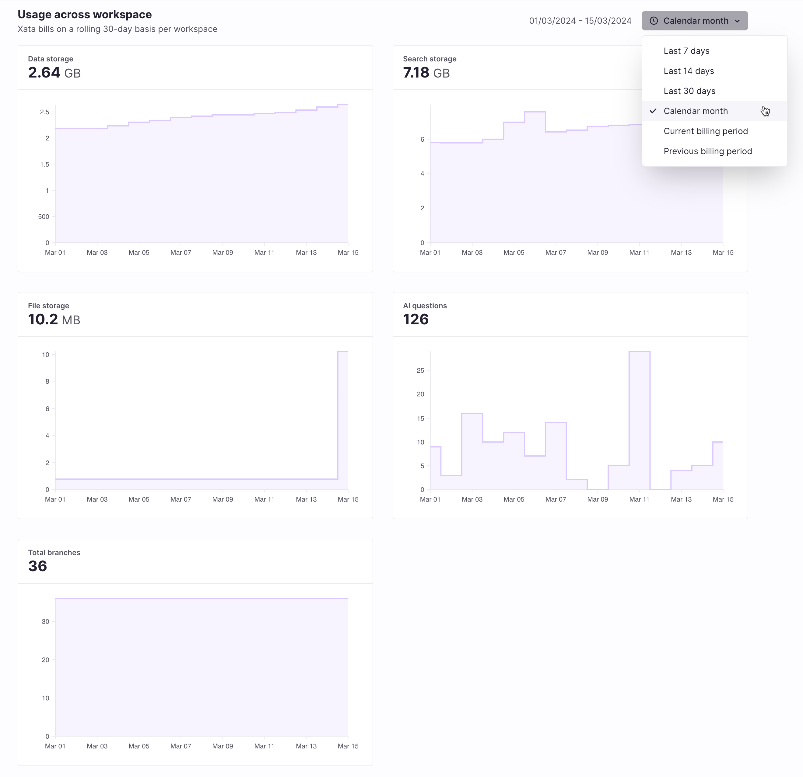
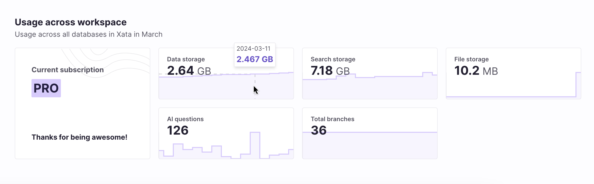

Usage monitoring is a new feature that visualizes usage of the Xata resources available to users. This beta release lets users explore their usage metric data at a workspace level for the first time.

Xata tracks and displays the following metrics so that customers can gain insight into their usage of Xata:

- Data storage: The storage on disk consumed by Postgres
- Search storage: The storage on disk dedicated search indexing
- File storage: The storage on disk consumed by file attachments
- AI questions: The number of questions sent to the Xata [AI ask](https://xata.io/docs/sdk/ask) endpoint
- Total branches: The current total number of of database branches

We are actively working on enhancements to the usage monitoring feature. We will soon expose these metrics on a database branch level as well, and we plan to release further metric insights in time.

## Feature description

The usage monitoring feature introduces a new Usage page showing detailed metrics over a number of time ranges to choose from. This new page is exclusively available to our [pro plan](/docs/concepts/pricing#pro-plan) workspaces.

Additionally, pro plan workspaces receive a metrics summary for the current calendar month on the workspace landing page. This gives users an up-to-date, high level overview of the workspace usage at a glance.

[Free plan](/docs/concepts/pricing#free-plan) workspaces can also get a glimpse into their usage on the workspace landing page. This concisely shows the percentage of available [free tier resources](/docs/concepts/pricing#pricing-plans) that have been used in the current calendar month.

## Technical details

As you would expect, the data we track comes from a variety of sources and we wanted to collect it all into a single place.

In order to power this feature we had to choose a database that is well suited to collect and report time series data and also met our usage requirements:

- Fast inserts
- Fast and flexible querying (ideally using SQL)
- Support for rollup and eviction of old date
- Efficient on disk storage
- Support for high cardinality metrics

After investigating and experimenting with many different databases we eventually landed on [Clickhouse](https://clickhouse.com/) because it meets all of the above requirements on paper and after some real world experimentation they all held up in practice.

### Architecture

In order to collect the data in (near) real time, we have two collection strategies:

1.  Poll usage data from existing backends (Postgres, Search, Attachments)
2.  React to real time usage events (AI questions, branch changes)

**Polling**

We have an existing task scheduler and background job processor which we use to periodically spawn collection jobs in each region. These jobs then concurrently fan out to all databases within their region, collecting usage data, collating it and then storing it in Clickhouse using their [bulk insert](https://clickhouse.com/docs/en/cloud/bestpractices/bulk-inserts) mechanism.

**Event processing**

For events caused by user actions we rely on the fact we store metadata about these events in DynamoDB. AWS provides a number of mechanisms for reacting to changes in Dynamo data and in our case we send change events to [Kinesis](https://aws.amazon.com/pm/kinesis/?trk=76c15db0-b03d-4489-8fe0-42aff7b6e211&sc_channel=ps&ef_id=Cj0KCQjwncWvBhD_ARIsAEb2HW9zGa3r1jh-nzDKgk5C1rMZRK7bdwnIRJRxh3hdsW48wzVwj2ooGr8aArRlEALw_wcB:G:s&s_kwcid=AL!4422!3!651612449030!e!!g!!amazon%20kinesis!19828211163!146688868243&gclid=Cj0KCQjwncWvBhD_ARIsAEb2HW9zGa3r1jh-nzDKgk5C1rMZRK7bdwnIRJRxh3hdsW48wzVwj2ooGr8aArRlEALw_wcB) which in turn spawns a lambda function which writes the event into Clickhouse. Although there are a more moving parts, it allows us to record these events almost instantaneously as well as providing a level of resilience in the face of failures since events can build up in the queue until Clickhouse is ready to receive them.

**On disk compression**

One of the most impressive aspects of Clickhouse in practice is how well data is compressed on disk which is thanks in a large part to its decision to store data by column. If values in a column don’t change that frequently over time, which is often the case, then the column data can be very easily compressed.

For example, let’s take the case of tracking Postgres disk usage over time. We’re tracking four pieces of data each time we take a snapshot:

- User workspace id
- User branch id
- Disk used in bytes
- Timestamp

Because we take snapshots of this data, each row in a single snapshot will all contain the same timestamp. In practice this means that Clickhouse only needs to store the value once as well as a corresponding counter to indicate how many rows it applies to.

Also, because we have chosen to use the [Merge Tree](https://clickhouse.com/docs/en/engines/table-engines/mergetree-family/mergetree) backend on Clickhouse it will occasionally merge snapshots together allowing it to further combine rows for the same workspace or branch together. This allows Clickhouse to efficiently store data that has a relatively low cardinality, but at the same time doesn't stop it from being able to also store high cardinality data.

## Learn more and try it out today

Want to learn more about the development of this feature, the folks that built it and watch a quick demo of it in action? Check out our latest meet the makers session here.

<ArticleVideo platform="youtube" src="https://www.youtube.com/embed/1u_QoU0ckbg?si=Srq0YFvhafSpyFDe" />

Pop into [Discord](https://xata.io/discord) and say hi if you'd like to dig in further 👋

Interested in trying out for yourself? [Sign up today](https://app.xata.io/signup)! Happy building 🦋
