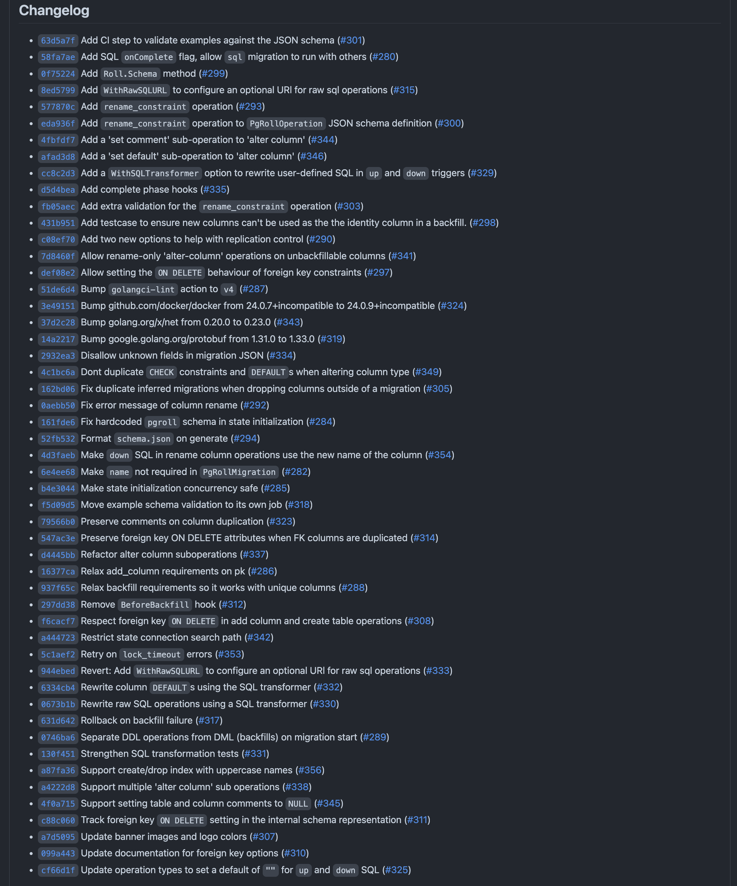

[pgroll](https://github.com/xataio/pgroll) is Xata's open-source schema migration tool for Postgres. The feature that sets it apart from other migration tools is it's ability to perform multi-version schema migrations using the expand/contract pattern: while a migration is in progress, `pgroll` is able to present two versions of your database schema to client applications - the old version and the new. This means that client applications that depend on the old version of the database schema continue to function while the migration is in progress, making application deployments much simpler. Gone are the days of having to perform [complicated multi-step workflows](https://planetscale.com/docs/learn/handling-table-and-column-renames#how-to-rename-a-column-on-planetscale) to do simple schema changes without breaking clients.

`pgroll` is open-source under the Apache-2.0 license and developed in the open on [GitHub](https://github.com/xataio/pgroll).

We released [pgroll v0.1.0](https://xata.io/blog/pgroll-schema-migrations-postgres) in October 2023. Since then we've made [eight further releases](https://github.com/xataio/pgroll/releases) as we continue to build `pgroll` and turn it into a first-class open-source schema migration tool for Postgres.

In this post we'll have a look at the changes that went into the most recent release, `v0.6.0`.

## What's new in pgroll v0.6.0

There was a three month gap between the release of [v0.5.0](https://github.com/xataio/pgroll/releases/tag/v0.5.0) and [v0.6.0](https://github.com/xataio/pgroll/releases/tag/v0.6.0). As a result the changelog for `v0.6.0` is fairly extensive:



We'll pick out a few highlights from the changelog rather than going through every change in detail 😴

### Retry on lock timeout errors

We actually wrote an entire blog post about the Postgres lock graph and why it's important for a migration tool like `pgroll` to use appropriate `lock_timeout` values on DDL statements and to automatically backoff and retry on lock aquisition failures. As of `v0.6.0`, `pgroll` now does exactly this. Rather than repeat the same information here, take a look at our blog post on [schema migrations and the Postgres lock queue](https://xata.io/blog/migrations-and-exclusive-locks).

### Run all DDL operations before running any data migrations

`pgroll` runs migrations using the [expand/contract pattern](https://openpracticelibrary.com/practice/expand-and-contract-pattern/) which means that, for example, when adding a constraint to a column `pgroll` will create a new column, add the constraint to the new column and run a data migration to move data from the old column to the new, using the user-defined `up` and `down` SQL expressions in the migration file. The old column will be removed on migration completion.

As of `v0.6.0`, `pgroll` will now run all DDL operations before running any data migrations. Previously, any data migrations required by a `pgroll` operation would run inline immediately after the operation that required it. Data migrations are the most time-consuming part of a migration so by running them in a group after DDL has completed, `pgroll` ensures that the database schema is fully expanded before running data migrations. This also opens the door to allowing finer control over the data migration process in future releases, for example providing control over batch sizes, [controlling the rate of data migrations](https://github.com/xataio/pgroll/issues/168) or even running the data migration phase as an entirely separate step some time after DDL has completed.

### Modification of column default values

`pgroll` now supports changing column `DEFAULT` values. A migration to do so looks like this:

```json
{
  "name": "02_change_default",
  "operations": [
    {
      "alter_column": {
        "table": "events",
        "column": "name",
        "default": "'new default value'"
      }
    }
  ]
}
```

Changing a column default is a versioned operation so the column to which the new default is applied is duplicated and backfilled according to the `up` and `down` SQL supplied with the 'alter column' operation. `up` and `down` default to a simple copy of the field between new and old columns.

See the documentation for the [alter column operation](https://github.com/xataio/pgroll/tree/main/docs#change-default) for more information.

### Changing multiple column properties in one operation

One significant limitation in versions of `pgroll` prior to `v0.6.0` was that `alter_column` operations could only change one 'property' of a column at a time. If, for example, you wanted to set a column to `NOT NULL` and add a `CHECK` constraint at the same time this would have to be done as successive migrations. As of `v0.6.0` however, there is no restriction on the number of changes that can be made to the same column in the one operation.

A migration that changes multiple column properties in one operation looks like this:

```json
{
  "name": "35_alter_column_multiple",
  "operations": [
    {
      "alter_column": {
        "table": "events",
        "column": "name",
        "name": "event_name",
        "type": "text",
        "default": "'new default value'",
        "nullable": false,
        "unique": {
          "name": "events_event_name_unique"
        },
        "check": {
          "name": "event_name_length",
          "constraint": "length(name) > 3"
        },
        "up": "(SELECT CASE WHEN name IS NULL THEN 'placeholder' ELSE name END)",
        "down": "name"
      }
    }
  ]
}
```

See the documentation for the [alter column operation](https://github.com/xataio/pgroll/tree/main/docs#alter-column) for more information.

### Renaming constraints

Perhaps it's a smaller change than others listed here, but the ability to rename constraints is a useful addition to `pgroll` `v0.6.0`. A migration to rename a constraint looks like this:

```json
{
  "name": "33_rename_check_constraint",
  "operations": [
    {
      "rename_constraint": {
        "table": "people",
        "from": "name_length",
        "to": "name_length_check"
      }
    }
  ]
}
```

See the documentation for the [rename constraint operation](https://github.com/xataio/pgroll/tree/main/docs#rename-constraint) for more information.

### Running raw SQL migrations on completion

`pgroll` supports raw SQL migrations as an 'escape hatch' when there is no other way to perform a migration using the existing `pgroll` operations. SQL migrations offer none of the multi-version guarantees inherent in other `pgroll` operation types; when a SQL migration runs it is applied directly to the underlying schema and `pgroll` does not present versions of the schema before and after the change as it does for other operation types.

In versions of `pgroll` before `v0.6.0`, SQL migrations would always be run on migration start. As of `v0.6.0`, SQL migrations have the option to run on migration complete instead by setting the `onComplete` field. Such a migration looks like:

```json
{
  "name": "32_sql_on_complete",
  "operations": [
    {
      "sql": {
        "up": "ALTER TABLE people ADD COLUMN birth_date timestamp",
        "onComplete": true
      }
    }
  ]
}
```

The ability to run a raw SQL migration on completion allows the SQL statement to reference the versioned views that `pgroll` creates for any non raw SQL operations in the same migration.

See the documentation for the [raw SQL operation](https://github.com/xataio/pgroll/tree/main/docs#raw-sql) for more information.

## Using pgroll as a module

The next two features relate to using `pgroll` from within other programs rather than as a standalone CLI tool. `pgroll` is written in Go and its core APIs can be imported and used as a module from other Go programs. These APIs are not stable yet; they will become stable as part of a `v1.0.0` release, but can be used today by importing the relevant packages from the `github.com/xataio/pgroll/` module:

```go
import (
	"github.com/xataio/pgroll/pkg/migrations"
	"github.com/xataio/pgroll/pkg/roll"
	"github.com/xataio/pgroll/pkg/state"
)
```

`pgroll` `v0.6.0` adds two new features that are exposed only when using `pgroll` as a module from within another Go program:

### Rewriting or rejecting user input SQL

`pgroll` takes SQL as input from the user in various places in migration files:

- `up` and `down` SQL for data migrations
- `up` and `down` SQL for raw SQL migrations
- column `DEFAULT` values

In most scenarios the fact that this is untrusted user input is not a problem; the typical use case for a migration tool like `pgroll` is for running migrations authored by the same set of users as own the database to which the migrations are applied. However in a multi-tenant environment, migration authors aren't the owners of the database instance where the migrations are run. In such a scenario, it may be desirable to restrict the range of allowable SQL expressions usable within `pgroll` migrations.

As of `v0.6.0`, `pgroll` allows rewriting and rejecting user input SQL expressions using the `SQLTransformer` interface and the `roll.WithSQLTransformer` option.

```go
type SQLTransformer interface {
	TransformSQL(sql string) (string, error)
}
```

A SQL transformer can be provided as an option to the `roll.New` function:

```go
m, err := roll.New(ctx, pgURL, schema, state,
  roll.WithSQLTransformer(sqlTransformer),
)

// ...

m.Start(...)
```

The provided SQL transformer will be used to rewrite and if necessary, reject, user input SQL expressions before they are executed by `pgroll`.

### Hooks

`pgroll` `v0.6.0` adds a new `MigrationHooks` struct that can be used to provide hooks that are called at various points during the migration execution process. The four hooks available in `v0.6.0` are:

- `BeforeStartDDL` - called before the DDL phase of migration start
- `AfterStartDDL` - called after the DDL phase of migration start is complete
- `BeforeCompleteDDL` - called before the DDL phase of migration complete
- `AfterCompleteDDL` - called after the DDL phase of migration complete is complete

And the hooks struct itself is defined like this:

```go
// MigrationHooks defines hooks that can be set to be called at various points
// during the migration process
type MigrationHooks struct {
	// BeforeStartDDL is called before the DDL phase of migration start
	BeforeStartDDL func(*Roll) error
	// AfterStartDDL is called after the DDL phase of migration start is complete
	AfterStartDDL func(*Roll) error
	// BeforeCompleteDDL is called before the DDL phase of migration complete
	BeforeCompleteDDL func(*Roll) error
	// AfterCompleteDDL is called after the DDL phase of migration complete is complete
	AfterCompleteDDL func(*Roll) error
}
```

Hooks can be provided to the `roll.New` function via an option on construction:

```go
m, err := roll.New(ctx, pgURL, schema, state,
		roll.WithMigrationHooks(roll.MigrationHooks{
			BeforeStartDDL: func(m *roll.Roll) error {
				// ...
			},
			AfterStartDDL: func(m *roll.Roll) error {
				// ...
			},
			BeforeCompleteDDL: func(m *roll.Roll) error {
				// ...
			},
			AfterCompleteDDL: func(m *roll.Roll) error {
				// ...
			},
		}),
)


// Hooks will be executed at the appropriate points during the migration
m.Start(...)
m.Complete(...)
```

Using hooks allows for custom logic to be run at various points during the migration process. For example, a hook could be used to log the start and end of a migration, or to send a notification when a migration completes.

## Conclusion

`pgroll` `v0.6.0` is a significant release that adds a number of new features and improvements to the tool. But of course, we're not done yet - work on the next version continues apace, as we work towards a [v1.0.0](https://github.com/xataio/pgroll/milestones) release of `pgroll`.

We'd love to hear from you if you're using `pgroll` in your projects. We welcome external contributions to `pgroll`, either in the form of issues on the [issue tracker](https://github.com/xataio/pgroll/issues) or by getting involved with development directly by opening [pull requests](https://github.com/xataio/pgroll/pulls).
