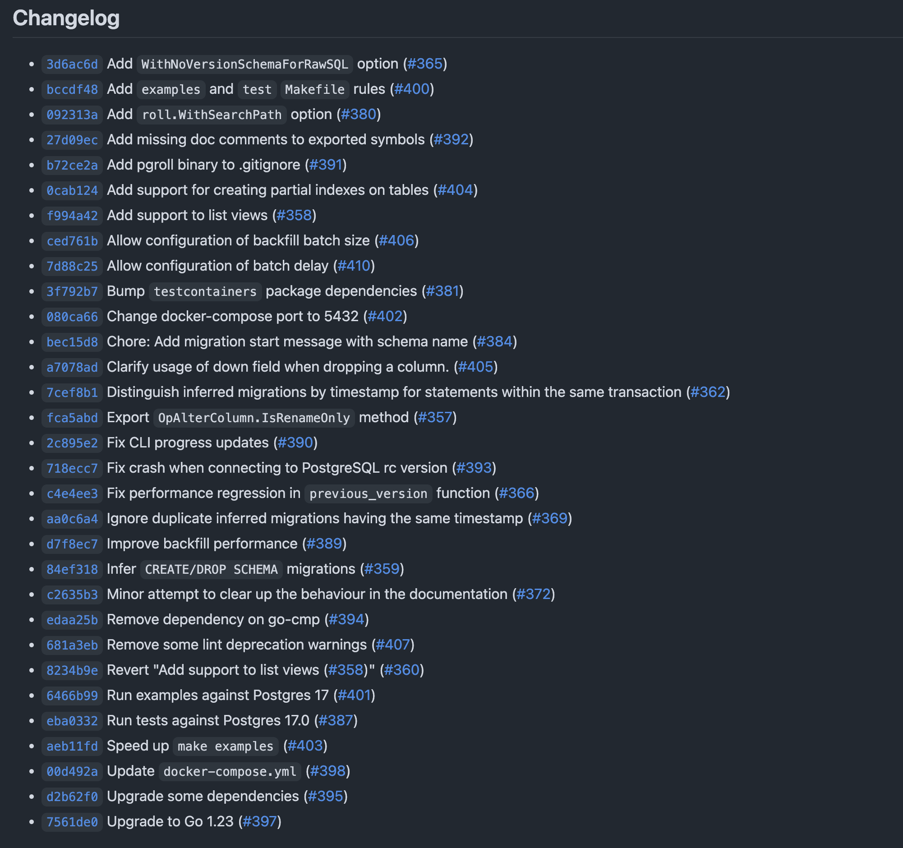

[pgroll](https://xata.io/pgroll) is Xata's open-source schema migration tool for Postgres. The feature that sets it apart from other migration tools is its ability to perform multi-version schema migrations using the expand/contract pattern: while a migration is in progress, `pgroll` is able to present two versions of your database schema to client applications - the old version and the new. This means that client applications that depend on the old version of the database schema continue to function while the migration is in progress, making application deployments much simpler. Gone are the days of having to perform [complicated multi-step workflows](https://planetscale.com/docs/learn/handling-table-and-column-renames#how-to-rename-a-column-on-planetscale) to do simple schema changes without breaking clients.

`pgroll` is open-source under the Apache-2.0 license and developed in the open on [GitHub](https://github.com/xataio/pgroll).

Since the last pgroll [0.6.0 release](https://xata.io/blog/pgroll-0-6-0-update) in July 2024, we've introduced key updates aimed at solving common database migration challenges. Support for Postgres 17 ensures compatibility with the latest version, while improvements to backfill performance—now up to 80% faster—means less time waiting for migrations to start. Configurable batch sizes and delays offer developers more control over the migration process, optimizing performance and minimizing impact on their Postgres clusters. These enhancements make migrations faster, safer, and more efficient, especially for complex or large datasets.

In this post we'll have a look at the changes that went into the most recent release, `v0.7.0`.

## What's new in pgroll v0.7.0

The previous version of `pgroll`, `v0.6.0`, was released in May 2024. It's seen steady development since May with 31 pull requests merged in that time. Happily, this release also includes work from six first time contributors! We're building `pgroll` in the open and we're always happy to see people getting involved on the issue tracker and through pull requests.

The full changelog for `v0.7.0` can be found [here](https://github.com/xataio/pgroll/releases/tag/v0.7.0):



In this post we'll focus on some of the highlights from the changelog.

### Postgres 17 support

Postgres 17 [was released](https://www.postgresql.org/about/news/postgresql-17-released-2936/) in September 2024. `pgroll` now supports Postgres 17, alongside our existing support for Postgres versions 14, 15, and 16.

### Backfill performance improvements

`pgroll` `v0.7.0` performs much better than previous versions when backfilling large tables. Backfills are central to the expand/contract pattern that `pgroll` uses to perform schema migrations. When a column is modified, for example to add a new constraint, `pgroll` creates a new column with the new constraint and backfills data from the old column to the new one on migration start.

Backfills are, unavoidably, long-running operations for tables with many records but `pgroll` `v0.7.0` includes performance improvements that can reduce the duration of a backfill by as much as 80%.

The performance improvement was achieved by reducing the work done by the 'up' trigger that constitutes the 'inner loop' during a backfill. [#389](https://github.com/xataio/pgroll/pull/389) has all the details if you're curious.

### Configurable backfill batch size

Another important backfill-related change that went into `v0.7.0` is the ability to configure the batch size for backfills. In previous versions of `pgroll` backfills were batched, processing each batch of 1000 records in a separate transaction in order to minimize the duration for which locks were held on the rows in the table.

In `pgroll` `v0.7.0` the same batched behaviour still applies but the batch size can be tuned through the `--backfill-batch-size` command line flag or the `PGROLL_BACKFILL_BATCH_SIZE` environment variable. For tables where row locks during migration start are less of a concern, for example append-only tables with few row `UPDATE`s, increasing the batch size can improve performance of the backfill by requiring fewer transactions and fewer round trips to the database.

### Configurable backfill delays

Again with the backfills, `pgroll` `v0.7.0` adds the ability to configure a delay between backfill batches. Previous versions of `pgroll` would always attempt to backfill batches as fast as possible, with no delay between each batch. `pgroll` `v0.7.0` adds the ability to introduce a delay between batches by using the `--backfill-batch-delay` command line flag or the `PGROLL_BACKFILL_BATCH_DELAY` environment variable.

Controlling the rate of the backfill can be useful in scenarios where the database is under heavy load and you want to reduce the impact of the backfill so as not to disrupt other database clients. Downstream replicas can also become overloaded by a backfill and slowing the rate at which backfills are performed prevents replicas falling too far behind the primary.

### Partial index support

As of `v0.7.0`, `pgroll` supports [partial indexes](https://www.postgresql.org/docs/current/indexes-partial.html) as part of the [create_index](https://github.com/xataio/pgroll/blob/main/docs/README.md#create-index) operation by specifying a `predicate` field:

```json
{
  "name": "37_create_partial_index",
  "operations": [
    {
      "create_index": {
        "name": "idx_fruits_id_gt_10",
        "table": "fruits",
        "columns": ["id"],
        "predicate": "id > 10"
      }
    }
  ]
}
```

Partial indexes allow specifying a predicate as part of the operation to restrict the set of records included in the index. This is helpful to reduce the size of an index, given that the query planner will likely not use the index to find common values anyway.

## Conclusion

`pgroll` is in active development as we work towards a [v1.0](https://github.com/xataio/pgroll/milestone/2) release of the project. The features added in `v0.7.0` represent another step in this direction, improving performance, fixing bugs and adding new features.

October is [Hacktoberfest](https://hacktoberfest.com/) and we've tagged some issues with the [Hacktoberfest label](https://github.com/xataio/pgroll/issues?q=is%3Aissue+is%3Aopen+label%3Ahacktoberfest). We've had a couple of contributions from new contributors via Hacktoberfest already this month and we're always open to more.

We'd love to hear from you if you're using `pgroll` in your projects. We welcome external contributions to the project, either in the form of issues on the [issue tracker](https://github.com/xataio/pgroll/issues) or by getting involved with development directly by opening [pull requests](https://github.com/xataio/pgroll/pulls).
