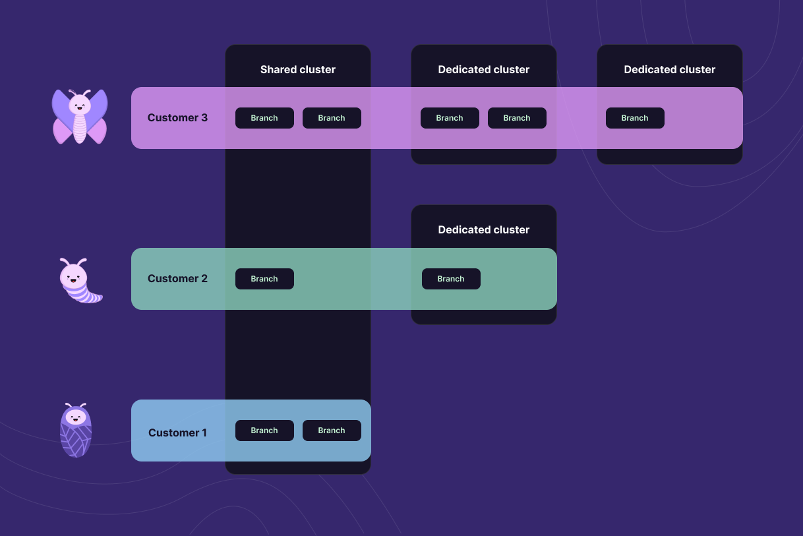

Starting today, Xata databases and branches are also serverless Postgres databases. This means you can connect to them using any Postgres client and generally use them as you would use any other Postgres database, while **still keeping** everything that you loved about Xata: instant DB/branch creation, zero cold starts, no pausing/sleeping in case of inactivity, the full-text search engine, the file attachments, and more. And yes, the Xata free tier also applies to the Postgres databases, making it one of the most generous free tiers for Postgres in the industry.

Making this possible was an interesting technical challenge and is the result of several Postgres-related projects coming together. We'll go into more detail in this blog post.

The new Postgres-enabled databases are in public beta, and you can try them out now using the instructions below.

<DocsEnablePostgres />

## Who are we?

If you haven't heard about Xata before, let's start with some introductions. In November 2022, we [launched](https://xata.io/blog/xata-public-release) the Xata database service with a product that aimed to provide the best possible developer experience for a database. We felt back then that databases have been left behind a little when it comes to modern developer workflows, APIs, and experience in general. So we re-thought things from the ground up, without tying ourselves to any existing database technology.

We imagined our product as the middle ground between Airtable and traditional databases, and we think we've done a pretty good job at sticking to that vision. Like in Airtable, "xatabases" start instantly, have rich types, have no cold starts, and are never paused. Like in traditional databases, they have no row limitations, have ACID transactions, constraints with referential integrity, and are highly performant.

Since then, tens of thousands of developers discovered Xata, actively used it in their applications, and have given us extremely valuable feedback. Developers in our [community](https://xata.io/blog/tags/community) appreciate how easy Xata is to get started with, iterate quickly, and the feeling that it's more like a SaaS product than another DBaaS.

Over the past year, we have continued to release features that show the value of a database platform, as opposed to a DBaaS. From a new git-like [developer workflow](https://xata.io/blog/workflow-github-vercel-netlify-xata) for making schema changes with our branching functionality, to [file attachments](https://xata.io/blog/file-attachments), which make it easy to work with files and images as columns in your database. These features generated a [lot](https://x.com/rauchg/status/1651614599874252802?s=20) of [excitement](https://news.ycombinator.com/item?id=37324370).

Last but not least, we have open sourced [pgroll](https://github.com/xataio/pgroll), a tool that provides zero-downtime and reversible schema migrations for any PostgreSQL database. This has also generated [quite](https://news.ycombinator.com/item?id=37752366) a bit of [interest](https://simonwillison.net/2024/Jan/30/pgroll/) from the broader Postgres community. Later this week we'll be announcing another open source project that we think you'll love 🦎.

## The serverless Postgres service

This brings us to today's launch: a new serverless Postgres service at the center of the Xata platform. Looking at the Postgres service in isolation (ignoring everything else in the Xata platform), it fares pretty well:

- Separation of compute and storage, providing bottomless storage.
- Optional automatic scaling up and down based on the load.
- High availability via read replicas in multiple availability zones and automatic failover.
- Support for both the native Postgres wire protocol and SQL over HTTP (for easy access from edge functions).
- Support for the most common Postgres extensions.
- The ability to scale up to 1TB of RAM and 128 vCPUs.

We have designed the Postgres service to optimize for **reliability**, **scalability**, and **cost efficiency**.

#### Reliability

The Xata Postgres service is using AWS Aurora under the hood, a battle-tested service that is used by many very large Postgres installations. We have been using AWS Aurora since the initial Xata launch and we have a reliability [track record](https://www.xatastatus.com/) that we are proud of. We now also have an official [SLA](/docs/appendix/sla).

Even at the free tier we offer high-availability and redundancy, with replicas running in multiple availability zones. Failover from the primary instance to a replica is automatic and is guaranteed to have no data loss. At the storage layer, data is synchronously replicated to six storage nodes across three availability zones.

#### Scalability

Available instance types in Xata go up to **128 vCPUs and 1TB of RAM**. Storage can be scaled up to 128TiB per cluster. That is quite a lot of headroom for vertical scaling.

When it comes to horizontal scaling, the fact that you can create databases and branches instantly across the globe and that you can move them between clusters without downtime, opens up several architectural possibilities. For example, you can create a logical database for each of your customers, and place them in different regions. This is possible thanks to our [global control plane and logical databases](/docs/concepts/serverless-data-platform#global-control-plane-for-databases-and-branches).

#### Cost efficiency

Xata offers a high degree of **optionality** which results in cost efficiency for across a wide range of use cases. Xata makes it really easy to move from one type of cluster to another, so you can try your workload on different types of clusters to determine which is the best fit from a performance and cost-efficiency perspective.

At small scale, we offer a **free tier** that includes high-availability and read replicas, no cold-starts, and no instance-pausing-after-a-few-days. We can offer this sustainably because the free tier makes use of [shared clusters](/docs/concepts/serverless-data-platform#shared-postgres-clusters) and auto-scaling.

At large scale, when using [dedicated clusters](/docs/dedicated-cluster) (currently in private alpha) you pay for the resources you use and have a high degree of control. For example, for predictable load, you can configure a particular instance size, while for an unpredictable load, auto-scaling might be more cost-efficient. Similarly, you can choose between standard storage and I/O optimized storage, which is more cost-efficient for I/O-heavy workloads.

## The free tier

Given that free plans across the industry have recently tended to die early, you might be looking a bit skeptically at our 15GB free storage, HA included, no-cold-starts, too-good-to-be-true free tier. We know that trust is won over many years (and lost in minutes), that we are a startup doing startup-y things, and that interest rates _something something_, but we think there are a couple things that are worth saying:

First, the Xata architecture was built from the start to be able to offer a free tier sustainably, thanks to the use of shared clusters and auto-scaling. Currently, a free **active** database with constant traffic within the rate limits costs us less than $1.5/month. That includes not only Postgres but also Elasticsearch and the replication between them, as well as running two replicas for high-availability.
This is possible thanks to our shared clusters (see [The implementation](#the-implementation)). The cost per database will go further down as we disable search and replication if not used at all, offload databases to cold storage if inactive for several months, and so on. In other words, while an active free-tier database that makes use of all the features might cost us a couple of dollars per month, the cost of a mostly inactive free database will come close to zero.

Secondly, the free tier is important to us because of the company history. The idea of Xata was born out of a [non-profit](https://www.tupu.io/), when we realized that managing databases is a limiting factor for many small projects. Today I'm proud to say that multiple non-profits are building on top of Xata, some on the free tier.

## The platform

It's quite possible to use Xata as a Postgres service and nothing else, and we couldn't be happier if you do. However, the way we think about Xata is not as a Postgres DBaaS, but as a **data platform for PostgreSQL**: multiple services and tools, integrated together much more tightly than in a classical cloud provider to simplify the way developers build data-centric applications and manage databases.

This is the Xata platform at the high level:

Data is automatically replicated, including schema changes, via logical replication to Elasticsearch, which serves our search, vector search, and aggregations endpoints, so the areas in which it excels. Files are stored in S3 and served through the Cloudflare CDN. The replication events are used to keep a reference count of the files, so they can be shared between branches, yet deleted when they are no longer needed.

If file attachments or full-text search or vector/hybrid search are important for your application, Xata will likely offer you a better platform to build on top than a classical DBaaS. And it's only the beginning, we are planning to have similar tightly-integrated solutions for time-series, intelligent caching, queuing, and more.

## The implementation

One key concept in the Xata implementation is the notion of _logical database branches_. A database can have multiple branches, and always has at least one, called `main` by default. A database branch is represented in Postgres as a [schema](https://www.postgresql.org/docs/current/ddl-schemas.html), and can be allocated on one of many Postgres clusters around the world, as well as moved from one cluster to another.

This results in a level of decoupling between the logical databases and branches as experienced by the application, and the underlying Postgres instances where they are running. Because the clusters are already provisioned, logical databases and branches can be started instantly and allocated and moved depending on the business needs. This unlocks some interesting use cases, like sharding per tenant where every tenant is a branch, using a logical database for each micro-service, or automatically creating developer branches for each pull request. We use this logical separation in our free tier, where many small databases and branches share the same relatively large underlying Postgres cluster.

In order to make this possible, we had to solve several challenges:

- Route traffic to the correct cluster based on metadata about the database branch.
- Ensure that a branch level connection can only access that single branch.
- Ensure that attackers can't call dangerous SQL functions.
- Limit noisy-neighbor issues in the shared clusters.

#### SQL Proxy

The key to the solution for most of these issues is our SQL Proxy technology. While there are many Postgres proxies (e.g. pgbouncer, pgcat, Supavisor) serving various goals, the Xata SQL Proxy not only speaks the Postgres wire protocol, but also understands the SQL being executed at a fairly deep level. It can, for example, know which tables are accessed, which columns are requested, which functions are being called with which parameters, and so on. This allows us to block actions that would be dangerous for the Postgres cluster. While security is mostly ensured via Postgres roles, the Proxy can enforce rate and concurrency limits on shared clusters (we don't do this for dedicated clusters).

The Proxy allows us to "virtualize" access not only to the data in the branch, but also to the Postgres catalog of tables, functions, sequences, and so on. ORMs like Prisma and Drizzle do fairly complex introspection to see the tables and columns that are currently defined, and we wanted to make sure they work without any modifications.

You might be wondering why we chose to represent database branches as Postgres schemas rather than separate Postgres databases. The reason has to do with logical replication, which is a key component of the database platform, because reliable change-data-capture (CDC) is such an important feature keeping multiple data stores in sync. Individual databases would have forced us to do a replication slot for each.

#### Logical replication events

Speaking of logical replication, another challenge that we had to solve was getting not only data events, but also schema events from Postgres. A well known limitation of the Postgres logical replication system is that it only includes data changes, not DDL changes. Yet, having schema changes in the same stream of events significantly simplifies the downstream consumers for the logical replication events. The way we solve this is by installing [DDL event triggers](https://www.postgresql.org/docs/current/event-triggers.html) that are writing the schema changes to an "out-box" table, which gets replicated via the same replication slot.

We think this tech will be useful for many Postgres applications, so we are planning to open source it soon as its own project.

#### Integrated pgroll

Another key piece of the new Xata architecture is [pgroll](https://github.com/xataio/pgroll), our open-source project for zero-downtime, reversible, schema migrations.

While `pgroll` is a CLI tool, in order to offer its benefits to all the Xata users, we have developed a server wrapper for it, which integrates with our control plane. This server offers an API for specific migrations as well as automatically intercepts DDLs executed over the wire protocol. This allows us to offer some of the benefits of pgroll nativly in the Xata platform, without you even having to know that you are using pgroll!

While there is still work to do fully integrate pgroll, we already get some important benefits: maintaining a history of the schema migrations, avoiding [locking issues](https://xata.io/blog/postgres-schema-changes-pita) automatically, and enabling more complex migrations that require data backfill. We don't yet expose multiple versions of the schema at the same time, but we are planning to do so in the future. This will be key to enabling a simple and safe workflow for schema migrations of all kinds, and we're excited for that future.

Look out for a detailed blog post this week about pgroll and how we integrated it into Xata.

## Learn more

Learn more about the development of this service from the folks that built it, and watch a quick demo to see it in action. Check out our latest meet the makers session here:

<ArticleVideo platform="youtube" src="https://www.youtube.com/embed/d-u2Naheqc4?si=dx9ZfGYTzD95-h26" />

Pop into [Discord](https://xata.io/discord) and say hi if you'd like to dig in further 👋

If you don't yet have a Xata account, there's no better time to [create one](https://app.xata.io/signup)!

[launch-week-blog]: https://xata.io/blog/...
