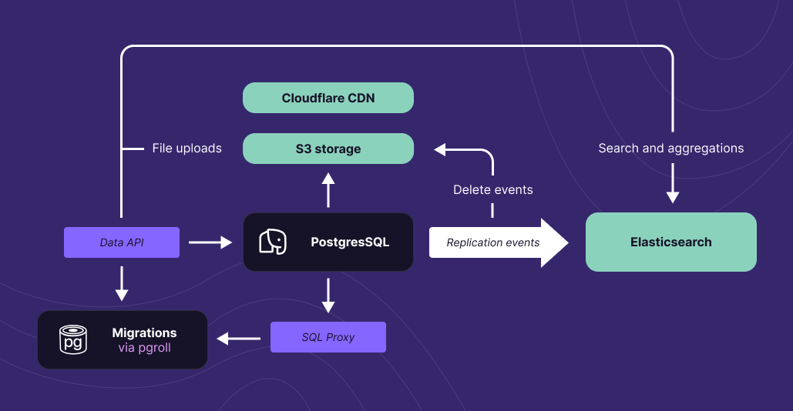

Starting today, Xata databases and branches are also serverless Postgres databases. This means you can connect to them using any Postgres client and generally use them as you would use any other Postgres database, while **still keeping** everything that you loved about Xata, including instant DB/branch creation, zero cold starts, no pausing/sleeping in case of inactivity, the full-text search engine, the file attachments, and more.

Making this possible was an interesting and large technical challenge (see below in the blog post), but we think it was well worth it and it resulted in a managed Postgres service that is quite different from what you are used to.

## Who are we?

If you haven't heard about Xata before, let's start with some introductions. In November 2022, we [launched](https://xata.io/blog/xata-public-release) the Xata database service with a product that aimed to provide the best possible developer experience for a database. We felt back then that databases have been left behind a little when it comes to modern developer workflows, APIs, and experience in general. So we re-thought things from the ground up, without tying ourselves to any existing database technology.

We imagined our product as the middle ground between Airtable and traditional databases, and we think we've done a pretty good job at sticking to that vision. Like in Airtable, the "xatabases" start instantly, have rich types, have no cold starts, and are never paused. Like in traditional databases, they have no row limitations, have ACID transactions, constraints with referential integrity, and are highly performant.

Since then, a few tens of thousands of developers discovered Xata, used it in their projects, and gave us extremely valuable feedback. As you'll see if you read our [community spotlights](https://xata.io/blog/tags/community), developers appreciate how easy Xata is to get started with and how it feels like a SaaS rather than a DBaaS.

Over the past year, we have released a new [developer workflow](https://xata.io/blog/workflow-github-vercel-netlify-xata) for making schema changes via our branches functionality, and then [File Attachments](https://xata.io/blog/file-attachments), which make it easy to work with large files and images in your database. Both these features generated a [lot](https://x.com/rauchg/status/1651614599874252802?s=20) of [excitement](https://news.ycombinator.com/item?id=37324370), and we think they push the state of the art just a little bit for [serverless data platforms](https://xata.io/blog/database-platforms-trend).

Last, but not least, we have open sourced of first major project, [pgroll](https://github.com/xataio/pgroll), a tool for zero-downtime and reversible schema migrations for PostgreSQL. This has also generated [quite](https://news.ycombinator.com/item?id=37752366) a bit of [interest](https://simonwillison.net/2024/Jan/30/pgroll/). This week, as part of our second launch week, we'll be announcing another Postgres-related open source project that we think you'll like.

## The Postgres service

This brings us to today's launch: a new serverless Postgres service, sitting at the center of the Xata platform. Looking at the Postgres service in isolation (ignoring everything else in the Xata platform), it fares pretty well:

- separation of compute and storage, and bottomless storage.
- optional automatic scaling up and down depending on the load.
- high availability via read replicas in multiple availability zones and automatic failover.
- support for both Postgres wire protocol and SQL over HTTP (for easy access from serverless functions).
- support for most common Postgres extensions.
- scale up to 1TB of RAM and 128 vCPUs.

We have designed it to optimize for **reliability**, **scalability**, and **cost efficiency**. A few words about each:

#### Reliability

The Xata Postgres service is using AWS Aurora under the hood, a battle-tested service that has been around for a few years and is used by many very large installations. We have been using AWS Aurora since the initial Xata launch and we have a very [good track record]() in terms of reliability. We are now also have an official [SLA]().

Even on the free tier we offer high-availability and redundancy, with replicas running in multiple availability zones. The failover from the primary instance to a replica is automatic and it's guaranteed to have no data loss. At the storage layer, the data is synchronously replicated to six storage nodes across three availability zones.

#### Scalability

Available instance types in Xata go up to 128 vCPUs and 1TB of RAM. Storage can be scaled up to 128TiB per cluster. That is quite a lot of headroom for vertical scaling.

When it comes to horizontal scaling, the fact that you can create databases and branches instantly and that you can move them between clusters without downtime, opens up several architectural possibilities. For example, you can create a logical database for each of your customers, and place them in different regions. This is possible thanks to our [global control plane and logical databases]().

#### Cost efficiency

Xata achieves cost efficiency for as many use cases as possible by offering a high degree of **optionality**. The innovation of the Xata service is that we make it really easy to move from one type of cluster to another, without downtime. This means that you can easily try your workload on different types of clusters and see which one is the most cost-efficient for you.

At small scale, we offer a free tier that includes high-availability and read replicas, no cold-starts, and no instance-pausing-after-a-few-days. We can offer this sustainably because the free tier makes use of [shared clusters]() and auto-scaling.

At large scale, when using [dedicated clusters]() you pay for the resources you use and you have a high degree of control. For example, for predictable load, you can configure a particular instance size, while for unpredictable load, auto-scaling will likely be more cost-efficient. Similarly, you can choose between standard storage and I/O optimized storage, which is more cost-efficient for I/O-heavy workloads.

## The free tier

Given that free plans across the industry tend to die early recently, you might be looking a bit skeptically at our 15GB free storage, HA included, no-cold-starts, too-good-to-be-true free tier. We know that trust is won over many years (and lost in minutes), that we are a startup doing startup-y things, that interest rates _something something_, but we think there are a couple things that are worth saying now.

First, the Xata architecture was built from the start to be able to offer a free tier sustainably, thanks to the use of shared clusters and auto-scaling. Currently, a free **active** database with constant traffic within the rate limits costs us less than $1.5/month. That includes not only Postgres but also Elasticsearch and the replication between them, as well as running a replica for high-availability.
This is possible thanks to our shared clusters (see [The implementation](#the-implementation)) and this cost per free database will go down significantly as we disable search and replication if not used at all, offload databases to cold storage if inactive for several months, and so on. In other words, the cost of a mostly inactive database is close to zero.

Secondly, the free tier is important to me personally because of the company history. The idea of Xata was born out of a non-profit, when we realized that managing databases is a limiting factor for many small projects. Today I'm proud to say that multiple non-profits are building on top of Xata, some on the free tier.

## The platform

It's quite possible to use Xata as a Postgres service and nothing else, and we couldn't be more happy if you do. However, the way we think about Xata is not as a Postgres DBaaS, but as a **data platform for PostgreSQL**: multiple services and tools, integrated together much closer than in a classical cloud provider, simplifying the way developers build data-centric applications and manage databases.

This is the Xata platform at the high level:

Data is automatically replicated, including schema changes, via logical replication to Elasticsearch, which serves our search, vector search, and aggregations endpoints, so the areas in which it excels. Files are stored in S3 and served through the Cloudflare CDN. The replication events are used to keep a reference count of the files, so they can be shared between branches, yet deleted when they are no longer needed.

If file attachments or full-text search or vector/hybrid search are important for your application, Xata will likely offer you a better platform to build on top than a classical DBaaS. And it's only the beginning, we are planning to have similar tightly-integrated solutions for time-series, intelligent caching, queuing, and more.

## The implementation

[launch-week-blog]: https://xata.io/blog/...
